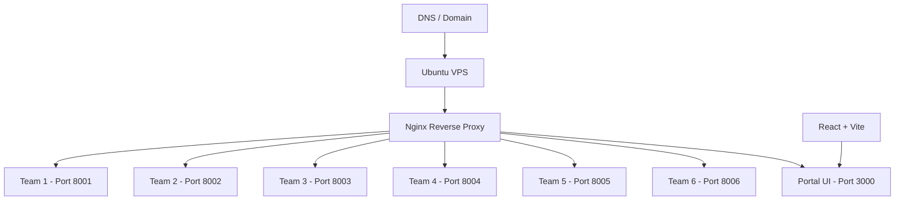

## Overview
Campus Portal was a personal initiative at the end of semester 4. Instead of each team running their Laravel applications locally on their own laptops during class demonstration — which would be chaotic and unreliable — I volunteered to set up a VPS and host all 6 applications on a single server. This was my first hands-on experience with server administration, Nginx reverse proxy, and DNS management.
## Problem
- Class demonstration involved 6 teams, each with a Laravel application
- Running applications locally on individual laptops led to inconsistent environments, port conflicts, and demo failures
- No centralized way for the lecturer and classmates to access all projects during the demonstration
## Goal
- Set up an Ubuntu VPS to host all 6 Laravel applications
- Configure Nginx reverse proxy with unique port bindings per team
- Build a portal UI as the entry point for accessing all projects
- Ensure applications were isolated and stable under concurrent access
## Role
I built the entire infrastructure and portal independently. This was a personal initiative, not a course requirement.
**Team:** Achmad Raihan Fahrezi Effendy (Solo — 100% contribution)
## Architecture

## Key Features
- **Multi-Application Hosting** — 6 Laravel apps running on a single VPS with isolated ports
- **Nginx Reverse Proxy** — Unique port bindings per team with clean URL routing
- **Portal UI** — React-based directory page listing all team projects
- **Firewall Configuration** — UFW rules to ensure only necessary ports were exposed
- **Concurrent Access Stability** — All applications remained stable during simultaneous demo usage
## Technical Decisions
- Ubuntu Server was chosen for its wide community support and familiarity
- Nginx was selected over Apache for its lighter resource footprint on a small VPS
- React + Vite was used for the portal UI because of fast development and build times
- Each team got a unique port to prevent conflicts and ensure isolation
## Challenges
- This was my first time managing a production server — learning SSH, Nginx config, and firewall rules from scratch
- Isolating 6 Laravel applications on a single VPS required careful resource management
- Configuring Nginx reverse proxy for each application took significant trial and error
## Outcome
The class demonstration ran smoothly with all 6 applications accessible through a single portal. The lecturer and classmates could access every project from their browsers without installing anything locally. This experience sparked my interest in infrastructure and DevOps.
## Final Thoughts
Campus Portal showed me that infrastructure is not just about servers — it is about solving problems. The code was simple (a React directory page), but the impact was real: a professional demonstration experience for the entire class. This project taught me that sometimes the most valuable work is not writing application code, but making other people's code accessible.
