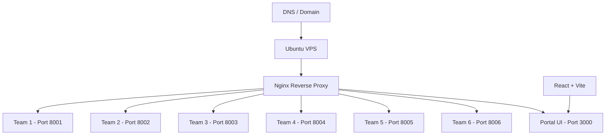

## Overview

Campus Portal was a personal initiative at the end of semester 4. Instead of each team running their Laravel applications locally on their own laptops during class demonstration — which would be chaotic and unreliable — I volunteered to set up a VPS and host all 6 applications on a single server. This was my first hands-on experience with server administration, Nginx reverse proxy, and DNS management. The project transformed a potentially messy demonstration into a professional, centralized experience accessible through a single URL.

## Problem

- Class demonstration involved 6 teams, each with a Laravel application that needed to be presented simultaneously
- Running applications locally on individual laptops led to inconsistent environments, port conflicts, and frequent demo failures
- No centralized way for the lecturer and classmates to access all projects during the demonstration
- Teams had varying levels of technical setup, making it difficult to ensure everyone could present their work smoothly

## Goal

- Set up an Ubuntu VPS to host all 6 Laravel applications on a single server
- Configure Nginx reverse proxy with unique port bindings per team for isolation
- Build a portal UI as the entry point for accessing all projects
- Ensure applications were isolated and stable under concurrent access during live demonstrations

## Role

I built the entire infrastructure and portal independently. This was a personal initiative, not a course requirement.

**Team:** Achmad Raihan Fahrezi Effendy (Solo — 100% contribution)

## User Stories

- **As a class lecturer**, I want to access all 6 team projects from a single URL so that I can evaluate demonstrations without switching between machines
- **As a student team member**, I want my Laravel app hosted on a stable server so that my demo doesn't fail due to local environment issues
- **As a portal visitor**, I want a clean directory page listing all projects so that I can navigate to any team's work instantly
- **As a server administrator**, I want each application isolated on its own port so that one app crashing doesn't affect the others
- **As a demonstration organizer**, I want all apps accessible simultaneously so that the class presentation runs smoothly without delays

## Use Case

**Scenario: Class Demonstration Day**

On presentation day, the lecturer opens the portal URL and sees a React-based directory page listing all 6 team projects. She clicks on Team 3's project, which Nginx routes to port 8003 on the Ubuntu VPS. Each team's Laravel application runs independently in its own process, isolated by port binding. The entire class accesses the projects concurrently through the portal without any application crashing or slowing down. After the demonstration, the server remains available for asynchronous evaluation.

## Architecture

## Key Features

- **Multi-Application Hosting** — 6 Laravel apps running on a single VPS with isolated ports and resource allocation
- **Nginx Reverse Proxy** — Unique port bindings per team with clean URL routing and automatic request forwarding
- **Portal UI** — React-based directory page listing all team projects with direct access links
- **Firewall Configuration** — UFW rules to ensure only necessary ports were exposed for security
- **Concurrent Access Stability** — All applications remained stable during simultaneous demo usage by the entire class
- **DNS Management** — Configured domain routing to point to the VPS for easy access

## Technical Decisions

- **Ubuntu Server** was chosen for its wide community support, extensive documentation, and familiarity with Linux server environments
- **Nginx** was selected over Apache for its lighter resource footprint on a small VPS, which was critical for running 6 applications simultaneously
- **React + Vite** was used for the portal UI because of fast development and build times, allowing rapid iteration
- Each team got a **unique port** to prevent conflicts and ensure complete isolation between applications
- **UFW firewall** was configured to restrict unnecessary port exposure and harden the server

## Challenges

- This was my first time managing a production server — learning SSH, Nginx configuration, and firewall rules from scratch under time pressure
- Isolating 6 Laravel applications on a single VPS required careful resource management to prevent any single app from consuming too much memory or CPU
- Configuring Nginx reverse proxy for each application took significant trial and error, especially handling path-based routing and static asset serving
- Coordinating with 5 other teams to understand their application requirements and port configurations added a communication challenge

## Outcome

The class demonstration ran smoothly with all 6 applications accessible through a single portal. The lecturer and classmates could access every project from their browsers without installing anything locally. The project eliminated setup inconsistencies and presentation failures that plagued previous demonstrations. This experience sparked my interest in infrastructure and DevOps, leading me to explore containerization and CI/CD in later projects.

## Final Thoughts

Campus Portal showed me that infrastructure is not just about servers — it is about solving problems. The code was simple (a React directory page), but the impact was real: a professional demonstration experience for the entire class. This project taught me that sometimes the most valuable work is not writing application code, but making other people's code accessible. The skills I gained here — server administration, reverse proxy configuration, and DNS management — became foundational for every deployment I handled afterward.
