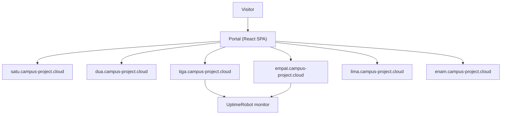

## Overview

Campus Portal is the entry point for a class demonstration that would otherwise have been chaos. Six teams each built a Laravel application for their Web Framework course, and every team planned to demo from their own laptop. I set up a VPS, hosted all 6 applications on a single server, and built a React portal as the front door. Instead of swapping cables and fighting port conflicts, the lecturer opened one URL and walked through all 6 projects. This repo is the portal itself.

| Metric | Value |
|---|---|
| Team apps hosted | 6 |
| Maintainers credited | 30 (5 per team) |
| Portal pages | 1 (SPA) |
| Frontend | React 18 + TypeScript + Vite |
| Monitoring | UptimeRobot status page |

## Problem

- Six teams each built a Laravel app that had to be presented at the same class session
- Running from local laptops caused environment drift, port conflicts, and demo failures
- There was no single place for the lecturer and classmates to reach every project
- Setting up each team's server locally meant 6 different configurations to babysit

## Goal

- Host all 6 applications on one Ubuntu VPS so every team demos from the same stable environment
- Give each team its own subdomain for isolation and clean URLs
- Build a portal page that lists the projects with links to each site and repo
- Add uptime monitoring so a dead demo is caught before the class starts

## Role

I built the portal and managed the hosting infrastructure as a personal initiative. The 6 applications belonged to their teams; my job was the deployment layer and the front door they all shared.

**Team:** Achmad Raihan Fahrezi Effendy (Portal + Infra) + 6 team projects

## Architecture

Each team's app gets its own subdomain under `campus-project.cloud`. The portal renders a card per project with a visit link, the GitHub repo, and the team's maintainers, plus a link to the uptime status page.

## Portal

The SPA has one route with three sections: a hero, a short class description, and a showcase grid. Each showcase card opens a detail modal with the 5 maintainers (name and NIM) and buttons for the live site and repository.

## Key Features

- **Six Project Cards**: One card per team with name, site link, repo link, and 5 maintainers
- **Detail Modal**: Click a card to see the full team roster and both action links
- **Clean Navigation**: Sticky nav with the status-page diagnostic link
- **Responsive Layout**: Tailwind-driven layout that holds up on projector and phone

## Technical Decisions

- **React + Vite** for a fast, static single page that deploys anywhere without a server runtime
- **Tailwind CSS** to style the whole portal without hand-written CSS files
- **Per-team subdomains** over ports, so each URL is clean and each app stays isolated
- **UptimeRobot** to watch all 6 sites and surface a failure before the demonstration

## Challenges

- Coordinating with 5 other teams on their port bindings and access needs took patience
- The portal had to load fast on the lab network, so the bundle stayed small
- Every subdomain needed DNS and a reverse-proxy entry before any team could test

## Outcome

The class demonstration ran from a single URL, with all 6 applications reachable and monitored. No team had to present from a flaky local laptop. The experience introduced me to server administration, reverse proxies, and DNS, which became the foundation for every deployment I handled afterward.

## Final Thoughts

Campus Portal taught me that infrastructure is a product too. The portal code was a day of React, but the real work was making 6 other teams' applications reliably reachable in one place. Sometimes the most valuable thing you can build is the door everyone else walks through.
