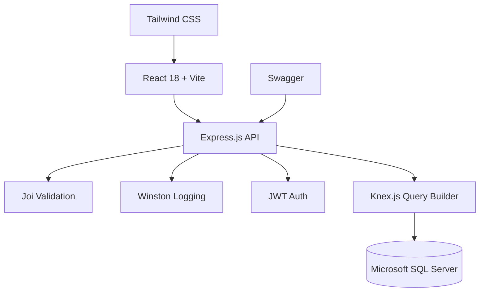

## Overview

Cat Stories (internally named "Platform Adopsi Kucing") was a database-focused project for a university course with a tight 2-week deadline. The system managed cat adoption data — tracking cats, adopters, and adoption records. I deliberately stepped outside my PHP comfort zone and chose Node.js + Express for the backend, making this my first project in the JavaScript backend ecosystem. The experience proved that backend architecture patterns transcend specific languages.

## Problem

- The coursework required a complete database application with REST API, validation, and documentation — all within 2 weeks
- I had only worked with PHP before this project — the Node.js ecosystem was unfamiliar territory
- The team needed API documentation that both frontend and backend developers could reference without constant communication
- Manual data validation was error-prone and led to inconsistent data entry across the team

## Goal

- Build a REST API with Express.js and Knex.js query builder for MSSQL
- Implement schema validation with Joi and structured logging with Winston
- Generate interactive API documentation with Swagger for team-wide reference
- Build a React frontend with Vite and Tailwind CSS for a clean adoption interface

## Role

I led the backend development while my teammate focused on the React frontend. I designed the API structure, validation logic, and documentation approach.

**Team:** Achmad Raihan Fahrezi Effendy (Backend Lead) + 1 teammate (Frontend)

## Architecture

## Key Features

- **REST API Architecture** — Clean endpoint design with consistent error handling and status codes
- **Schema Validation** — Joi validation for every request body and query parameter, catching errors before business logic
- **Structured Logging** — Winston logger with custom transports for request tracking and debugging
- **JWT Authentication** — Token-based auth for protected endpoints with refresh token support
- **Interactive API Docs** — Swagger UI for testing and documenting every endpoint in real-time
- **File Uploads** — Multer for handling multipart form data with validation
- **SQL Injection Protection** — Knex.js parameterized queries against MSSQL for database security

## Technical Decisions

- **Express.js** was chosen to explore Node.js backend development beyond PHP, expanding my technical breadth
- **Knex.js** provided a clean query builder without the overhead of a full ORM, allowing closer control over SQL generation
- **Swagger** was added early to keep the API contract visible and documented, reducing miscommunication between frontend and backend
- **Joi validation** caught errors at the request layer before they reached business logic, preventing invalid data from entering the system
- **Vite** was used for fast frontend development with React, enabling rapid iteration during the tight deadline

## Challenges

- Pivoting from PHP to Node.js under a 2-week deadline required rapid learning of npm, middleware patterns, and Express conventions
- Knex.js query syntax differs from raw SQL — translating complex queries with joins and aggregations took significant adjustment
- Integrating Swagger with Express required understanding OpenAPI specification format and middleware configuration
- Coordinating API contracts between frontend and backend with only two team members required efficient communication

## Outcome

The project was delivered on time with complete API documentation, validation, and logging. It demonstrated that backend concepts transfer across languages — the patterns I learned in PHP applied directly to Node.js. The API documentation became a reference that both team members used throughout development, reducing integration issues significantly.

## Final Thoughts

Cat Stories taught me that the language matters less than the architecture. REST APIs, validation, logging, and documentation work the same way whether you use PHP, Node.js, or anything else. The 2-week deadline forced efficiency, and the Node.js experience opened doors to TypeScript and NestJS in later projects. This project was a turning point in my backend development journey.
