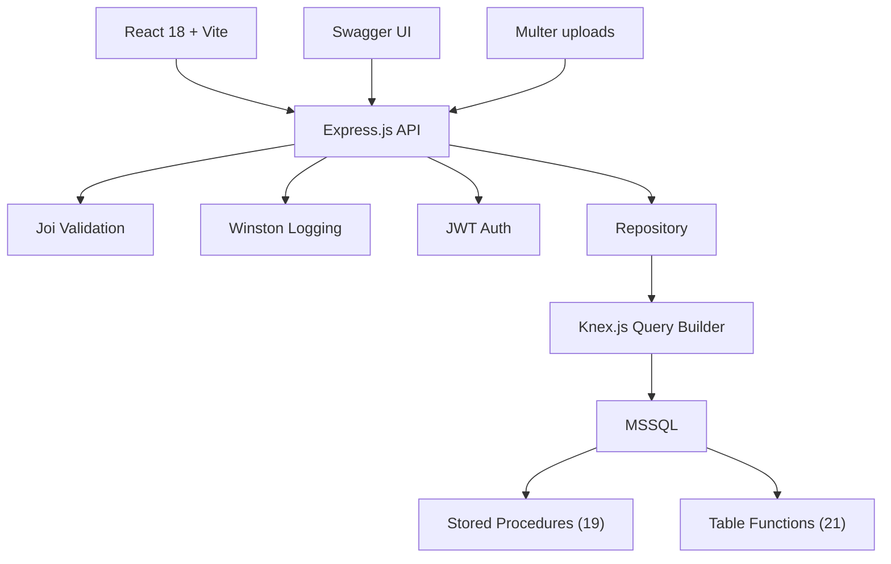
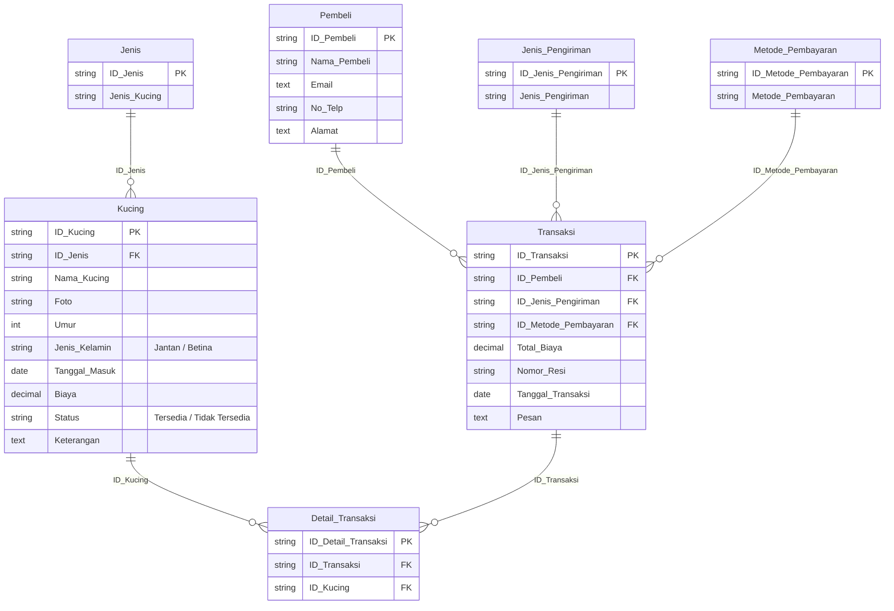
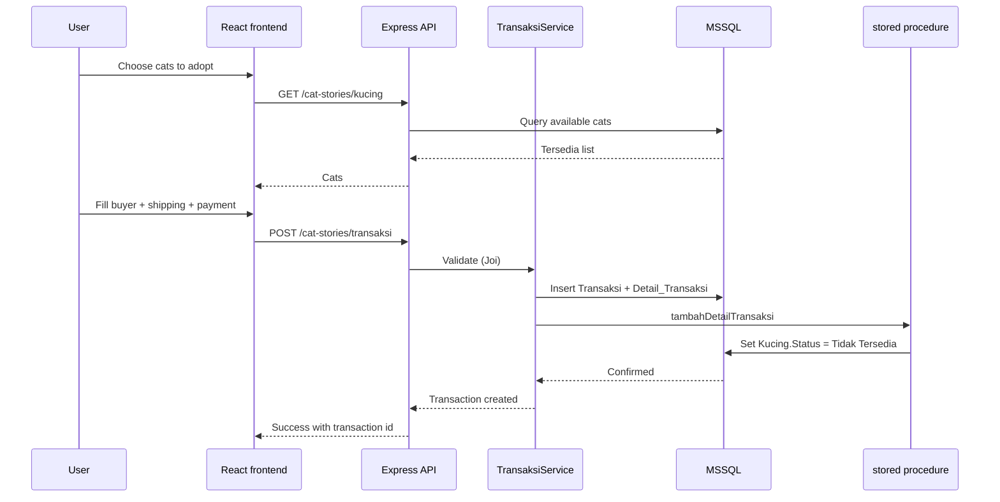

## Overview

Cat Stories is a cat adoption management panel built for a database course with a 2-week deadline. Staff register cats, buyers, breeds, shipping options, and payment methods, then process multi-cat adoptions end to end. Every backend I had built until then was PHP, so I chose Node.js and Express for this one. It became my first JavaScript backend. The project shipped on time with 33 endpoints, a 7-table MSSQL schema, and a database layer of 19 stored procedures and 21 table-valued functions.

| Metric | Value |
|---|---|
| Database tables | 7 (MSSQL) |
| Stored procedures | 19 |
| Table-valued functions | 21 |
| API endpoints | 33 |
| Frontend | React 18 + Vite + Tailwind |
| Deadline | 2 weeks |

## Problem

- The course wanted a complete database application with a REST API, validation, and documentation, all inside 2 weeks
- I had no Node.js experience; the Express ecosystem was new territory
- The team needed API documentation both sides could trust without constant back-and-forth
- Manual data validation let bad entries through and cost time during the tight deadline

## Goal

- Build a REST API with Express.js and the Knex.js query builder against MSSQL
- Move the database logic into stored procedures and table-valued functions
- Validate every request with Joi and log requests with Winston
- Ship a React frontend with Vite and Tailwind for the adoption workflow

## Role

I led the backend and designed the database layer while teammates built the React frontend. I structured the API, the validation logic, and the stored procedures.

**Team:** Achmad Raihan Fahrezi Effendy (Backend Lead) + 2 contributors

## Architecture

The Express API sits in front of 7 repositories that call Knex against MSSQL. Heavy database logic lives in 19 stored procedures and 21 table-valued functions, so the service layer orchestrates and the database does the work.

## Database Design

Seven tables model the domain. `Kucing` (cats) holds availability status, `Transaksi` records each adoption with buyer, shipping, and payment, and `Detail_Transaksi` links each adopted cat to its transaction. A stored procedure flips a cat's status to Tidak Tersedia the moment it is adopted.

## Adoption Flow

A user picks available cats, adds buyer, shipping, and payment details, and submits. The service validates with Joi, creates the transaction and its detail rows, then runs the stored procedure that marks each adopted cat as Tidak Tersedia so nobody can adopt the same cat twice.

## Key Features

- **Full CRUD Across 5 Entities**: Cats, breeds, buyers, shipping types, and payment methods
- **Multi-Cat Adoption**: One transaction can adopt several cats, with per-cat availability checks
- **Database Routines**: 19 stored procedures and 21 table-valued functions, including a 10-year monthly transaction pivot
- **Availability Integrity**: Adopting a cat automatically flips its status to Tidak Tersedia
- **Swagger UI**: Interactive documentation for testing every endpoint
- **Joi Validation**: Every request body and query parameter validated before business logic
- **Winston Logging**: Request tracking with custom transports
- **Multer Uploads**: Cat photos with mime-type and size validation
- **Parameterized Queries**: Knex against MSSQL, blocking SQL injection
- **Search + Sort**: Every list supports keyword search and in-memory ordering

## Routes

33 endpoints cover 5 entities under the `/cat-stories` prefix, plus auth and storage.

| Entity | Endpoints |
|---|---|
| Cats | 6 (CRUD + availability count) |
| Breeds | 5 |
| Buyers | 5 |
| Shipping | 5 |
| Payment | 5 |
| Transactions | 3 |
| Auth + storage | login, logout, file serving |

## Technical Decisions

- **Express.js** to move beyond PHP and test the JavaScript backend ecosystem
- **Knex.js** as a query builder instead of a full ORM, keeping control over the SQL that reaches MSSQL
- **Stored procedures and table-valued functions** for the database layer, since the course centered on MSSQL and this kept heavy queries close to the data
- **Joi** to catch errors at the request layer before they reached business logic
- **Swagger** added early so the API contract stayed visible to both teammates
- **Vite** for fast React development under the 2-week deadline

## Challenges

- Moving from PHP to Node.js under a 2-week deadline meant learning npm, middleware, and Express conventions on the fly
- Translating business logic into 40 stored routines took careful parameter and result design
- Knex.js query syntax differs from raw SQL, so joins and aggregations took adjustment
- Two-plus people coordinating an API contract demanded tight, frequent communication

## Outcome

The project delivered on time with a working adoption panel, a complete MSSQL schema, and 40 database routines. The course requirement was met. More useful for me, it proved that backend architecture transfers across languages: the patterns I knew from PHP carried into Node.js. The Swagger docs became the shared reference the team used, which cut integration issues to zero.

## Final Thoughts

Cat Stories taught me that the language matters less than the architecture. REST APIs, validation, logging, and documentation behave the same whether you write PHP, Node.js, or anything else. The database layer also taught me that pushing logic into stored procedures keeps the service layer thin. The 2-week deadline forced speed, and the Node.js experience opened the door to TypeScript and NestJS in later projects.
