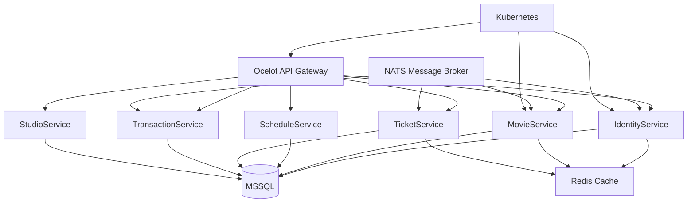

## Overview

Cinema Microservice was built during a two-week internship training program. The task was to learn .NET and build a microservice-based backend for a cinema domain. The system includes 7 services: IdentityService (JWT/OAuth), StudioService, MovieService, ScheduleService, TicketService, TransactionService, and Ocelot API Gateway. This was my first exposure to C# and the .NET ecosystem, requiring rapid learning of a new language and framework.

## Problem

- The internship training required learning .NET and building a microservice within two weeks — an aggressive timeline
- I needed to understand C#, Entity Framework Core, and the .NET dependency injection system from scratch
- The cinema domain required handling shows, seats, bookings, and payments across multiple services
- Distributed systems introduce complexity around service communication, data consistency, and deployment

## Goal

- Learn .NET fundamentals and build working microservices with proper service separation
- Implement NATS message broker for asynchronous inter-service communication
- Add Redis caching for frequently accessed data and Ocelot API Gateway for unified routing
- Create Kubernetes deployment manifests for container orchestration

## Role

I built the backend services independently during the training period, learning .NET while implementing the microservice architecture.

**Team:** Achmad Raihan Fahrezi Effendy (Backend Developer)

## Architecture

## Key Features

- **7 Microservices** — Identity, Movie, Studio, Schedule, Ticket, Transaction, API Gateway with clear separation of concerns
- **JWT/OAuth Authentication** — IdentityService handles authentication and authorization across all services
- **NATS Messaging** — Asynchronous communication between services for event-driven architecture
- **Redis Caching** — Cached frequently accessed data (movies, schedules) to reduce database load
- **Ocelot Gateway** — Unified entry point with routing, rate limiting, and request aggregation
- **Kubernetes Manifests** — Deployment configs for container orchestration and scaling
- **Entity Framework Core** — Standard ORM for data access with migrations and code-first approach

## Technical Decisions

- **.NET** was required by the training program, providing exposure to a major enterprise framework
- **Entity Framework Core** was used because it is the standard ORM in the .NET ecosystem with strong community support
- **NATS** was chosen for lightweight inter-service messaging, simpler than RabbitMQ for the training scope
- **Ocelot** provided a simple API gateway without the overhead of Kong or Envoy, appropriate for the project scale
- **Kubernetes manifests** were included to demonstrate container orchestration knowledge and deployment readiness

## Challenges

- Learning C# and .NET in two weeks while building a working project was intense — the language syntax, LINQ, and async/await patterns required rapid adaptation
- The dependency injection system in .NET is more explicit than in NestJS — understanding service lifetimes (Singleton, Scoped, Transient) took time
- Debugging across 7 services required learning new tools and distributed tracing concepts for a different ecosystem
- Coordinating data consistency across microservices without distributed transactions introduced new architectural challenges

## Outcome

The project was completed during the training period and demonstrated working microservice communication with NATS, Redis caching, and Ocelot routing. It showed me that backend concepts transfer across languages — dependency injection, service separation, and message brokers work the same way in .NET as in Node.js. The training experience expanded my technical versatility.

## Final Thoughts

Cinema Microservice taught me that the language matters less than the patterns. Dependency injection, service separation, and message brokers work the same way whether you use TypeScript, PHP, or C#. The two weeks were intense, but the breadth of experience was worth it. This project proved that my understanding of software architecture transcends any single technology stack, making me a more adaptable developer.
