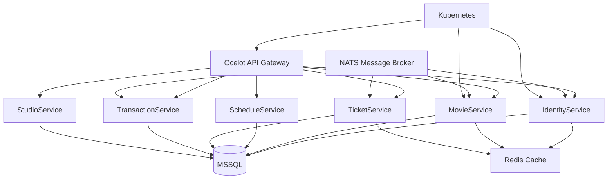

## Overview
Cinema Microservice was built during a two-week internship training program. The task was to learn .NET and build a microservice-based backend for a cinema domain. The system includes 7 services: IdentityService (JWT/OAuth), StudioService, MovieService, ScheduleService, TicketService, TransactionService, and Ocelot API Gateway. This was my first exposure to C# and the .NET ecosystem.
## Problem
- The internship training required learning .NET and building a microservice within two weeks
- I needed to understand C#, Entity Framework Core, and the .NET dependency injection system from scratch
- The cinema domain required handling shows, seats, bookings, and payments across multiple services
## Goal
- Learn .NET fundamentals and build working microservices
- Implement service separation with NATS message broker for inter-service communication
- Add Redis caching, Ocelot API Gateway, and Kubernetes deployment manifests
## Role
I built the backend services independently during the training period.
**Team:** Achmad Raihan Fahrezi Effendy (Backend Developer)
## Architecture

## Key Features
- **7 Microservices** — Identity, Movie, Studio, Schedule, Ticket, Transaction, API Gateway
- **JWT/OAuth Authentication** — IdentityService handles auth across all services
- **NATS Messaging** — Asynchronous communication between services
- **Redis Caching** — Cached frequently accessed data (movies, schedules)
- **Ocelot Gateway** — Unified entry point with routing and rate limiting
- **Kubernetes Manifests** — Deployment configs for container orchestration
## Technical Decisions
- .NET was required by the training program
- Entity Framework Core was used because it is the standard ORM in the .NET ecosystem
- NATS was chosen for lightweight inter-service messaging
- Ocelot provided a simple API gateway without the overhead of Kong or Envoy
- Kubernetes manifests were included to demonstrate container orchestration knowledge
## Challenges
- Learning C# and .NET in two weeks while building a working project was intense
- The dependency injection system in .NET is more explicit than in NestJS — understanding service lifetimes took time
- Debugging across 7 services required learning new tools and distributed tracing concepts
## Outcome
The project was completed during the training period and demonstrated working microservice communication with NATS, Redis caching, and Ocelot routing. It showed me that backend concepts transfer across languages.
## Final Thoughts
Cinema Microservice taught me that the language matters less than the patterns. Dependency injection, service separation, and message brokers work the same way whether you use TypeScript, PHP, or C#. The two weeks were intense, but the breadth of experience was worth it.
