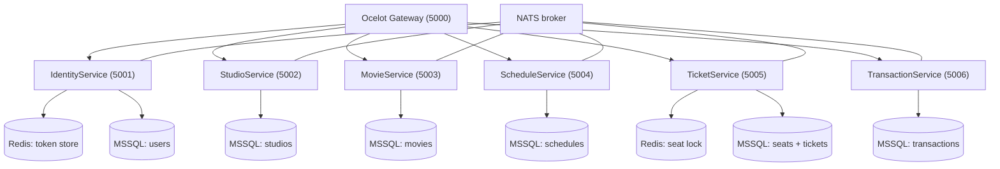
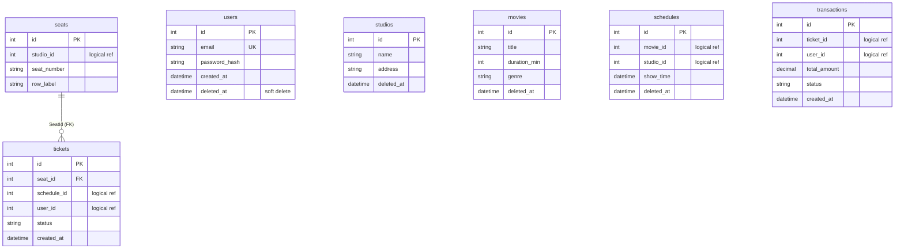
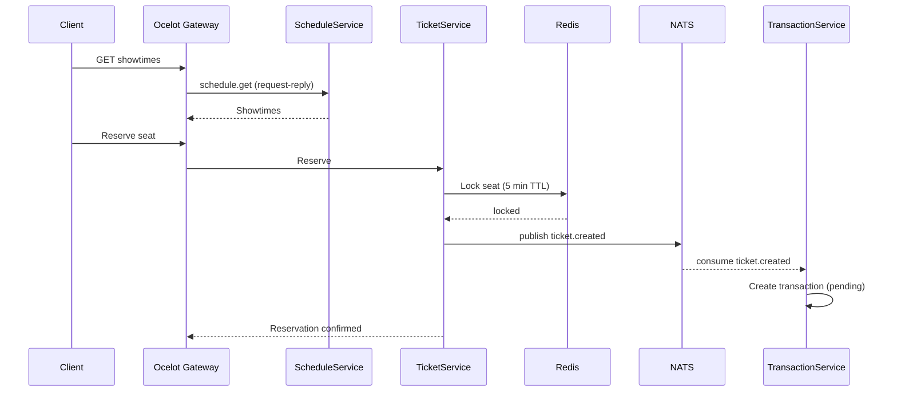

## Overview

Cinema Microservice was a two-week internship training project in .NET. The brief was to learn C# and build a microservice backend for a cinema domain, so I split the system into 6 services behind an Ocelot API gateway: identity, studio, movie, schedule, ticket, and transaction. The services talk over NATS with 22 message subjects, and Redis backs identity tokens and seat locking. It was my first C# codebase, and it grew to 14,000 lines across 6 databases.

| Metric | Value |
|---|---|
| Microservices | 6 + API gateway |
| Databases | 6 (one per service) |
| Tables | 7 |
| NATS subjects | 22 (6 request-reply + 16 events) |
| Gateway routes | 17 |
| Controller actions | 31 |
| Code size | 14,265 LOC |

## Problem

- The training demanded working microservices in a language I had never used
- Cinema booking spans movies, schedules, seats, and payments across separate services
- Services needed to coordinate without a shared database or distributed transactions
- The whole system had to route through a single API entry point

## Goal

- Learn C# and .NET while building real service separation
- Use NATS for asynchronous communication between services
- Add Redis for token revocation and seat locking
- Route everything through an Ocelot API gateway

## Role

I built the backend services independently during the training period, learning .NET while implementing the architecture.

**Team:** Achmad Raihan Fahrezi Effendy (Backend Developer)

## Architecture

Each service owns its database and exposes its domain through the gateway. Services coordinate over NATS, and Redis appears where it earns its place: identity token storage and ticket seat locking.

## Database Design

Each service owns one table (Ticket owns two). Cross-service references are logical ids, with a single enforced foreign key from `tickets` to `seats`.

## Booking Flow

A booking moves across services through NATS. The ticket service reserves a seat with a 5-minute Redis lock, publishes `ticket.created`, and the transaction service consumes it to build the payment record.

## API

Seventeen routes through the Ocelot gateway cover all 6 services.

| Service | Port | Domain |
|---|---|---|
| Identity | 5001 | register, login, token refresh |
| Studio | 5002 | studio CRUD |
| Movie | 5003 | movie CRUD |
| Schedule | 5004 | showtimes |
| Ticket | 5005 | seat reservation, ticket issue |
| Transaction | 5006 | payment records |

## Key Features

- **6 Owned Services**: Identity, Studio, Movie, Schedule, Ticket, and Transaction, each with its own database
- **NATS Messaging**: 22 subjects, 6 request-reply and 16 publish-subscribe events
- **Ocelot Gateway**: Single entry point routing to all services
- **JWT with JWKS**: Identity issues RS256 tokens and exposes a JWKS metadata endpoint
- **Redis Token Store**: Identity keeps active and revoked tokens in Redis
- **Redis Seat Lock**: Tickets lock a seat for 5 minutes during reservation, with a 10-minute pending window
- **EF Core Migrations**: Versioned schema per service with soft deletes

## Technical Decisions

- **.NET 8** because the training required it, and it forced me to learn a new ecosystem quickly
- **Entity Framework Core** as the standard .NET ORM, with one database per service
- **NATS** over a heavier broker for lightweight pub-sub and request-reply
- **Ocelot** as a minimal gateway appropriate for the training scope
- **Redis** only where it pays off, token revocation and short-lived seat locks, instead of caching everywhere
- **Logical cross-service ids** to keep services independent, with one physical FK only inside the ticket service

## Challenges

- Learning C#, LINQ, and async/await inside two weeks while building the whole system
- Debugging message flow across 6 services required tracing NATS subjects by hand
- Coordinating data across services without distributed transactions forced careful event design
- Keeping one database per service meant the schema had to be duplicated across boundaries

## Outcome

The training project produced a working microservice backend with NATS communication, Redis-backed seat locking, and a unified gateway. It proved that the patterns I knew from Node.js, dependency injection, service separation, and message brokers, carry straight into .NET. The system has no automated tests, and the docker-compose runs a subset of services, so the full stack runs best from the IDE.

## Final Thoughts

Cinema Microservice taught me that the language matters less than the patterns. Dependency injection, service separation, and event-driven communication work the same in TypeScript, PHP, and C#. The two weeks were intense, and the breadth of the .NET ecosystem was worth the speed of learning. This project made me more adaptable across backend stacks.
