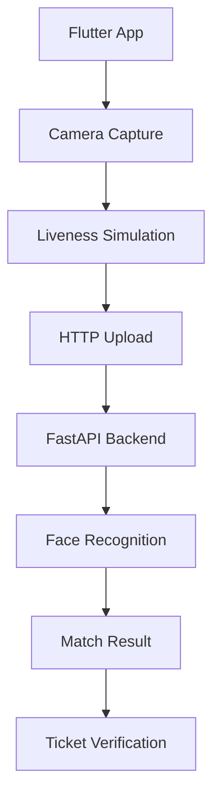

## Overview
Fest Ticketing App is the Flutter mobile client for the Fest Ticketing system. The app captures face images with liveness simulation (front, left, right, smile movements) and sends them to the FastAPI AI backend for face recognition. This was a team project under the organization `TI-3D`, where I focused on backend integration while the mobile team handled the Flutter UI.
## Problem
- The face recognition backend needed a mobile client to capture and send face images
- Liveness detection was required to prevent photo spoofing — the app needed to capture multiple angles
- The mobile team needed a clear API contract to integrate with the Python backend
## Goal
- Build a Flutter app that captures face images with liveness simulation
- Integrate with the FastAPI backend for face recognition
- Demonstrate end-end ticketing flow: registration → face capture → venue verification
## Role
I contributed to backend integration and API contract design, working alongside the mobile team.
**Team:** Achmad Raihan Fahrezi Effendy (Backend Integration) + Mobile Team
## Architecture

## Key Features
- **Face Capture** — Camera integration for capturing face images
- **Liveness Simulation** — Multi-angle capture (front, left, right, smile) to prevent photo spoofing
- **API Integration** — HTTP client for sending images to the FastAPI backend
- **Ticket Flow** — End-to-end flow from registration to venue verification
## Technical Decisions
- Flutter was chosen for cross-platform compatibility (Android + iOS)
- The app focused on capture and upload, delegating face recognition to the backend
- Liveness simulation used guided movements rather than active liveness detection
## Challenges
- Integrating Flutter camera with specific capture requirements (multiple angles) required custom UI flow
- Communication with the Python backend needed clear error handling for network issues
- The app was part of a larger system — changes in the backend API required corresponding mobile updates
## Outcome
The mobile app successfully captured face images and sent them to the backend for recognition. The end-to-end ticketing flow was demonstrated in the course presentation.
## Final Thoughts
Fest Ticketing App showed me that mobile-backend integration is about clear contracts and error handling. The app itself was straightforward, but making it work reliably with an AI backend required careful API design and testing. This experience reinforced my preference for backend work — I enjoy the challenge of making systems work together.
