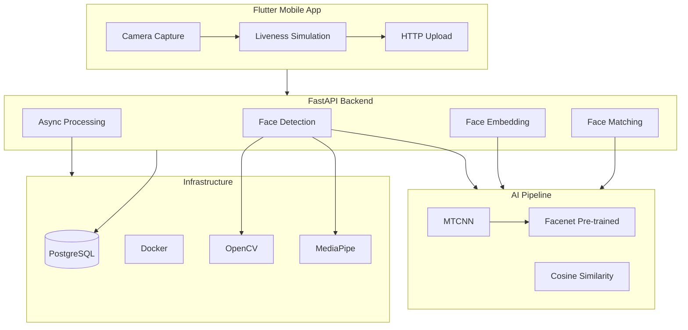

## Overview

Fest Ticketing is a complete AI-powered face recognition ticketing system built as a combined project for 3 university courses — Digital Image Processing, Machine Learning, and Mobile Programming. The system lets attendees register their face via a Flutter mobile app, then at the venue, a camera captures their image and the FastAPI backend matches it against stored embeddings.

I built the AI backend pipeline (Python/FastAPI) while collaborating with the mobile team on the Flutter client. The result is a working PoC that proves face recognition can replace traditional paper or barcode-based ticketing.

## Problem

- Traditional ticketing systems can be bypassed with stolen or shared tickets — there's no way to verify the person holding the ticket is the one who bought it
- The coursework required integrating AI (face recognition) with a mobile application across three separate courses
- Training a face recognition model from scratch was not feasible within the deadline and hardware constraints
- The face recognition backend needed a mobile client capable of capturing and sending face images reliably
- Liveness detection was required to prevent photo spoofing — the app needed to capture multiple angles

## Goal

- Build a backend API that handles face detection, embedding generation, and matching
- Integrate pre-trained models (MTCNN + Facenet) instead of training from scratch
- Create a Flutter app that captures face images with liveness simulation
- Demonstrate end-to-end ticketing flow: registration → face capture → venue verification
- Build a working PoC that proves the concept is viable for real-world event access

## Role

I built the AI backend pipeline independently and contributed to backend integration and API contract design, working alongside the mobile team (Flutter) and a frontend team.

**Team:** Achmad Raihan Fahrezi Effendy (AI Backend Engineer + Backend Integration) + Mobile Team + Frontend Team

## User Stories

- **As an attendee**, I want to register my face via the mobile app so that I can enter the event without a physical ticket
- **As an event organizer**, I want to verify attendees automatically at the venue so that I can reduce queue times and eliminate paper tickets
- **As a security team member**, I want to prevent ticket sharing so that only registered attendees gain access to the event
- **As a venue operator**, I want the face recognition process to complete in under 3 seconds so that foot traffic flows smoothly at entry points
- **As a festival attendee**, I want to capture my face from multiple angles so that the system can detect spoofing attempts and protect my identity

## Use Case

**Scenario: Festival Entry Verification**

An attendee arrives at the festival entrance and opens the Fest Ticketing mobile app. The app guides them through a liveness simulation — capturing their face from the front, left, right, and while smiling — and uploads the images to the FastAPI backend. MTCNN detects the face in each image, Facenet generates a 128-dimensional embedding, and the vector is stored in PostgreSQL. At the venue, a camera captures the attendee's face in real time. The backend runs cosine similarity against stored embeddings, confirms a match, and signals the turnstile to open — all in under 3 seconds.

## Architecture

## Key Features

- **Face Detection** — MTCNN detects faces in uploaded images with bounding box coordinates, handling varying lighting conditions and angles
- **Face Embedding** — Facenet generates 128-dimensional face vectors for precise comparison
- **Face Matching** — Cosine Similarity compares embeddings to identify registered users against the database
- **Liveness Simulation** — Flutter app captures multiple angles (front, left, right, smile) as a guided liveness check to prevent photo spoofing
- **Async Processing** — FastAPI handles concurrent face recognition requests efficiently for venue-scale throughput
- **Cross-Platform Client** — Flutter mobile app works on both Android and iOS with a single codebase
- **End-to-End Ticket Flow** — Registration → face capture → database storage → venue verification in one seamless loop

## Technical Decisions

- **FastAPI** was chosen for its async support and Python ecosystem for AI/ML libraries — natural fit for the recognition pipeline
- **Pre-trained models (MTCNN + Facenet)** were used instead of training from scratch due to time and hardware constraints — not a compromise, but a practical decision
- **Cosine Similarity** was selected for face matching because of its simplicity and effectiveness on normalized embeddings
- **PostgreSQL** was used for storing face embeddings with vector operations
- **Flutter** was chosen for cross-platform compatibility (Android + iOS) with a single codebase
- **Docker** was used for containerizing the backend, ensuring consistent deployment across environments

## Challenges

- **Model Training Failure** — Training a custom face recognition model failed due to time and hardware limitations. Pivoting to pre-trained models was a critical decision that saved the project
- **Varying Conditions** — The face recognition pipeline needed to handle varying lighting conditions, angles, and image quality from mobile cameras
- **Cross-Stack Integration** — Integrating the Flutter mobile app with the Python backend required careful API design, clear error handling for network issues, and coordination across teams
- **API Contract Drift** — Changes in the backend API required corresponding mobile updates, enforcing tight versioning discipline
- **Liveness vs Security** — Guided movement capture (front, left, right, smile) was a practical trade-off between security and usability for a PoC

## Outcome

The system successfully demonstrated end-to-end face recognition for event ticketing. Users could register their face via the mobile app, and the backend could identify them at the venue. The working PoC proved the concept was viable, though it was not production-ready. The project was presented as the final deliverable for all three courses.

## Final Thoughts

Fest Ticketing taught me that a working PoC is better than perfect theory. The pivot from training custom models to using pre-trained models was not a compromise — it was a practical decision that delivered results within constraints. The experience also showed me how different tech stacks (Python AI backend + Flutter mobile) can integrate through well-designed APIs.

Mobile-backend integration is about clear contracts and error handling. The app itself was straightforward, but making it work reliably with an AI backend required careful API design and testing. This experience reinforced my preference for backend work — I enjoy the challenge of making systems work together.
