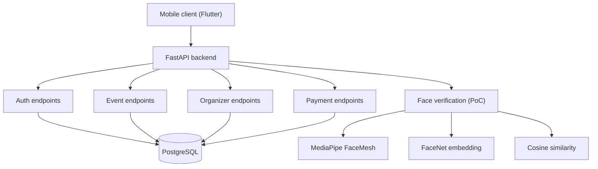
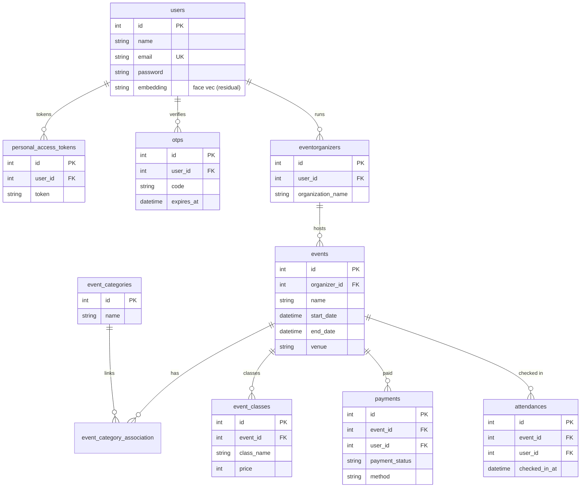
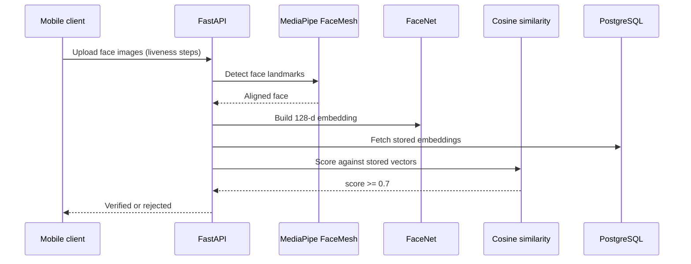

## Overview

Fest Ticketing is an event-ticketing backend built as a combined project for three university courses: Digital Image Processing, Machine Learning, and Mobile Programming. The FastAPI service exposes 27 endpoints for authentication, event and organizer management, and a payment flow, backed by an 11-table PostgreSQL schema. During the course window, the machine-learning thread built a face-verification proof of concept with MediaPipe FaceMesh, FaceNet, and cosine similarity; that pipeline is disabled in the current repository. The mobile client lives in a separate Flutter project.

| Metric | Value |
|---|---|
| API endpoints | 27 |
| Database tables | 11 |
| Backend | FastAPI + SQLAlchemy |
| Database | PostgreSQL (migrated from MongoDB) |
| Auth | OTP email verification + personal access tokens |
| Face PoC | MediaPipe FaceMesh + FaceNet + cosine similarity |

## Problem

- Ticket sharing and stolen tickets are hard to catch with paper or barcode entry
- The courses required integrating a machine-learning pipeline with a working backend
- Three separate course assignments had to share one coherent system
- The backend needed to be fast enough to verify an attendee at the gate

## Goal

- Build a FastAPI backend with event, organizer, auth, and payment flows
- Model the domain in PostgreSQL with clean relations
- Add a face-verification pipeline using pre-trained models, not a from-scratch trainer
- Wire a mobile client that can register a face and present it at the gate

## Role

I built the AI backend and API integration and collaborated on the API contract with the mobile team. The Flutter client is a separate project in the mobile course track.

**Team:** Achmad Raihan Fahrezi Effendy (AI Backend + Integration) + mobile and frontend tracks

## Architecture

The REST surface covers auth, events, organizers, users, and payments. The face-verification pipeline is a separate module that detects faces, builds embeddings, and scores matches.

## Database Design

Eleven tables model the ticketing domain: users with OTP verification and access tokens, event organizers, event categories and classes, events, payments, and attendances.

## Face Verification Flow

The verification pipeline uses MediaPipe to detect face landmarks, FaceNet to build a 128-dimension embedding, and cosine similarity with a 0.7 threshold to decide a match. A 5-step liveness sequence (look straight, blink, turn left, turn right) was part of the flow to slow down photo spoofing. This pipeline is currently disabled in the repository, and remains as the machine-learning proof of concept from the course window.

## API

Twenty-seven live endpoints under `/api/v1`.

| Area | Endpoints | Purpose |
|---|---|---|
| Auth | 7 | register, OTP verify, login, logout, access tokens |
| Organizer | 6 | manage organizers |
| Event | 8 | event CRUD, categories, classes |
| User | 1 | current user |
| Payment | 4 | create and confirm payments |

## Key Features

- **Event Management**: Events, categories, classes, and organizer CRUD
- **OTP Email Auth**: Signup verified by a one-time code before access
- **Access Tokens**: Token-based auth for protected endpoints
- **Payment Flow**: Payment creation and confirmation, mocked as a verification flow without a live gateway
- **PostgreSQL Schema**: 11 tables with Alembic migrations
- **Docker**: Compose setup for the API and database

## Technical Decisions

- **FastAPI** for async support and a natural fit with Python ML libraries
- **MediaPipe FaceMesh** over heavier detectors, for real-time landmark detection on device-class hardware
- **FaceNet embeddings** with **cosine similarity** instead of training a recognizer from scratch
- **PostgreSQL** after the initial MongoDB schema, for relational integrity across events, payments, and users
- **SQLAlchemy + Alembic** for the ORM and versioned migrations
- **Docker** for a reproducible backend and database setup

## Challenges

- The face-verification module was built under a course deadline and later disabled in the repo, so the pipeline is a proof of concept, not a production gate
- Coordinating the API contract with a separate Flutter team required tight versioning
- Migrating from MongoDB to PostgreSQL mid-project meant reworking the data layer
- Varying lighting and camera angles made the liveness check the most fragile part of the pipeline

## Outcome

The backend delivered working event-ticketing flows with a face-verification proof of concept that used a real ML pipeline end to end. The project was the final deliverable for all three courses. The face module demonstrated the core idea, while the REST backend remained the usable surface.

## Final Thoughts

Fest Ticketing taught me that a working proof of concept beats perfect theory. Pivoting from training a custom recognizer to composing MediaPipe and FaceNet delivered a working pipeline within the deadline. It also showed me how a Python AI backend and a separate mobile client meet at a clean API contract, and it sharpened my instinct for backend work over shipping the client.
