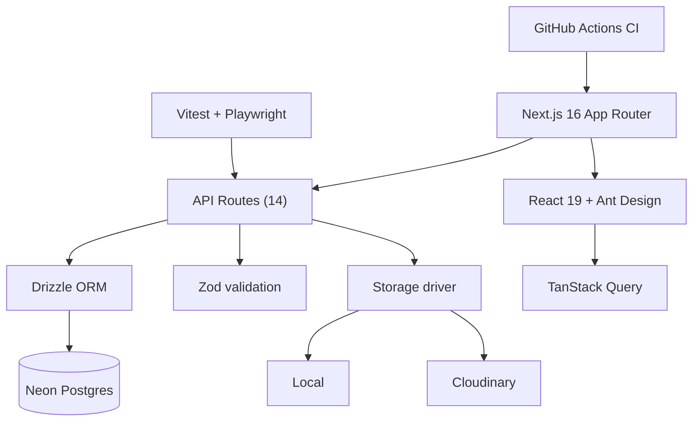
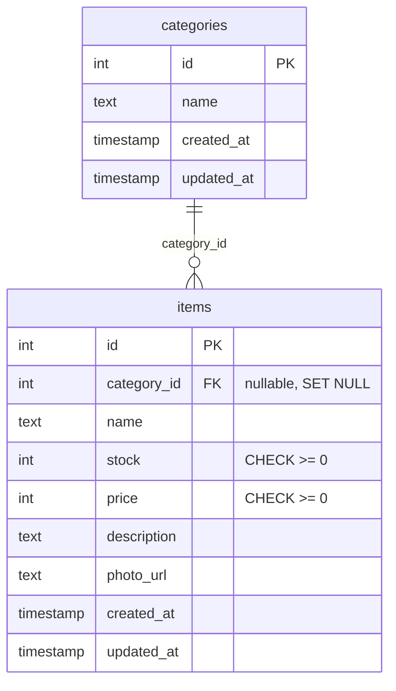

## Overview

Frozeria Next is a frozen-food stock tracker built for a BNSP certification assessment. The task was to prove full-stack skill with a working CRUD application, and this is the result: a Next.js 16 app with an Ant Design dashboard, a Drizzle-managed Postgres schema, Zod validation, 60 unit tests, Playwright smoke tests, and a CI pipeline that gates every change. It ties together the patterns I had built up across campus projects, competitions, and the internship.

| Metric | Value |
|---|---|
| Database tables | 2 (categories, items) |
| API endpoints | 14 |
| Unit tests | 60 (Vitest) |
| E2E tests | 3 Playwright specs |
| Pages | 4 |
| CI | type-check + lint + test + build on every PR |

## Problem

- Frozen-food businesses track stock across freezers in spreadsheets, which hides what is low
- The BNSP assessment demanded a production-quality app with real architecture, tests, and docs
- Certification reviewers want clean code and a documented API contract, not just working CRUD

## Goal

- Build a full-stack Next.js app with proper server/client separation
- Manage frozen-food items and categories with validation at every layer
- Make photo uploads work through a pluggable storage driver
- Ship tests and CI so the codebase holds up to certification review

## Role

I built the entire application independently, including the schema, API, tests, CI, and documentation.

**Team:** Achmad Raihan Fahrezi Effendy (Full-Stack Developer)

## Architecture

Every API route shares one response envelope with a request id, so errors and payloads are consistent across the app. Validation runs in Zod before any query, and tests plus CI wrap the whole thing.

## Database Design

The schema is deliberately small: `categories` and `items`, with a nullable foreign key that nulls out when a category is deleted. Non-negative stock and price are enforced at the database level with CHECK constraints.

## API

Fourteen endpoints under `/api/v1` cover the full CRUD surface plus dashboard and health checks.

| Area | Endpoints |
|---|---|
| Categories | GET, POST, PUT, DELETE |
| Items | GET list, GET by id, POST, PUT, DELETE |
| Dashboard | GET summary |
| Health | GET live, GET ready |
| Uploads | POST item photo (multipart) |

## Key Features

- **Item & Category CRUD**: Full management of frozen-food items grouped by category
- **Dashboard Summary**: Stock totals and low-stock alerting with a hardcoded threshold of 20
- **Photo Upload Driver**: Swappable storage backends with local and Cloudinary implementations
- **Zod Validation**: Every route validates input and returns a consistent 422 on bad data
- **Response Envelope**: One shared shape with request-id passthrough for every API call
- **Test Coverage**: 60 unit cases across services, schemas, and HTTP handling
- **Playwright Smoke Tests**: Category, dashboard, and help flows against a real database
- **CI Pipeline**: Type-check, lint, test, and build run on every PR and push to main
- **Documented Contract**: `docs/API_CONTRACTS.md` matches the actual implementation

## Technical Decisions

- **Next.js 16 App Router** for server components, API routes, and middleware in one framework
- **Drizzle ORM** over a full ORM, for SQL-like schema definitions and small bundle size
- **Ant Design** for enterprise-grade components without hand-building a design system
- **Zod** shared between client and server so one schema drives both sides
- **Storage driver interface** so local development and Cloudinary production swap by config
- **Vitest + Playwright** for fast unit tests plus real-browser smoke coverage
- **Neon Postgres** for a serverless database with no infrastructure to manage

## Challenges

- The pluggable storage abstraction had to behave identically across local and Cloudinary, so uploads never broke in one environment
- Certification-grade code meant documenting the API contract and keeping tests green alongside features
- Balancing scope with the assessment deadline forced a small, clean schema over a sprawling one

## Outcome

The application shipped with a documented API, 60 passing unit tests, Playwright smoke coverage, and a CI pipeline that blocks bad merges. It was submitted for BNSP certification as a demonstration of full-stack Next.js, TypeScript, and Drizzle proficiency.

## Final Thoughts

Frozeria Next tied my experience together. Campus projects taught fundamentals, competitions taught pressure, the internship taught production patterns, and this project proved I could package all of it into a polished, tested application. The discipline of writing tests and docs alongside features carried straight into the SAST thesis work that followed.
