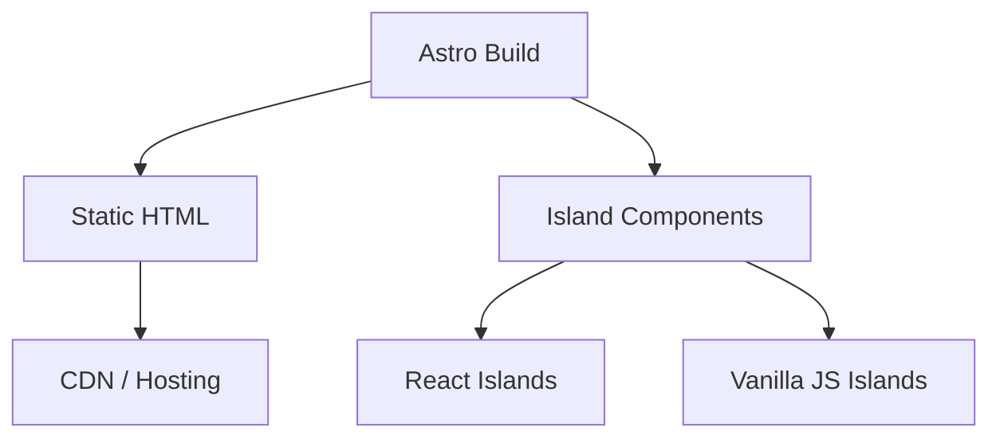

## Overview

InnovaTech was a national competition entry for the Itechno event in 2024. The project explored Astro as a static site generator, focusing on ultra-fast frontend performance and modern tooling. I participated as a team member, contributing to frontend development while learning Astro's island architecture and build-time rendering approach. The competition challenged teams to build performant web applications using contemporary frontend frameworks.

## Problem

- The competition required building a web application with modern frontend tooling that demonstrated performance best practices
- Static site generators offered performance benefits but were unfamiliar territory for the team
- The team needed to deliver a polished application within the competition deadline while learning new technology
- Balancing static content delivery with interactive components required careful architectural planning

## Goal

- Build a performant static site using Astro's build-time rendering capabilities
- Explore island architecture for partial hydration of interactive components
- Deliver a competition-ready application on time with polished UI
- Demonstrate understanding of modern frontend performance optimization techniques

## Role

I contributed to frontend development as part of the team, focusing on component architecture and performance optimization.

**Team:** Achmad Raihan Fahrezi Effendy (Team Member) + teammates

## User Stories

- **As a competition judge**, I want the site to load in under 1 second so that the performance demonstration is convincing
- **As a visitor**, I want the page content visible immediately without waiting for JavaScript to download so that the reading experience feels instant
- **As a developer on the team**, I want interactive components to hydrate independently so that static content loads fast while complex widgets still work
- **As a performance auditor**, I want minimal JavaScript shipped to the browser so that core web vitals scores stay high

## Use Case

**Scenario: Evaluating the Competition Entry**

A judge clicks the competition link and the page loads as pre-rendered HTML — text and layout appear instantly with no blank screen. A small interactive map widget hydrates only when it enters the viewport, downloading a minimal JavaScript bundle for that island. The rest of the page remains static HTML with zero JavaScript overhead. Lighthouse scores show near-perfect performance metrics, demonstrating that Astro's island architecture delivers on its promise of shipping minimal JavaScript by default.

## Architecture

## Key Features

- **Static Site Generation** — Pre-rendered HTML for maximum performance and minimal server load
- **Island Architecture** — Interactive components hydrated independently, loading JavaScript only where needed
- **Fast Build Times** — Astro's build process optimized for speed with efficient bundling
- **Minimal JavaScript** — Only interactive islands load JavaScript, reducing initial page weight
- **Performance-First Approach** — Architecture designed around core web vitals and loading speed

## Technical Decisions

- **Astro** was chosen for its performance-first approach and island architecture, aligning with competition requirements
- **Static generation** eliminated server-side rendering complexity while maximizing loading speed
- **Island architecture** allowed interactive components without loading a full SPA framework, reducing bundle size
- The team prioritized **build-time rendering** over runtime rendering for predictable performance

## Challenges

- Astro's content collection system and island architecture required learning new patterns compared to traditional SPA frameworks
- Balancing static content with interactive components needed careful planning to avoid hydration issues
- Competition deadlines forced prioritization of features, requiring decisions on what to include vs. defer
- Coordinating team members with varying Astro experience required clear documentation and communication

## Outcome

The team submitted the project for the InnovaTech 2024 competition. The experience provided exposure to modern frontend tooling and performance optimization techniques that influenced how I approach frontend architecture in subsequent projects. The performance benchmarks demonstrated the benefits of static generation and island architecture.

## Final Thoughts

InnovaTech taught me that frontend performance is not just about minification and caching — it is about architecture. Astro's approach to shipping minimal JavaScript by default changed how I think about frontend applications. The experience complemented my backend focus by showing how the frontend can be optimized at the build level, a lesson that influenced my approach to full-stack development.
