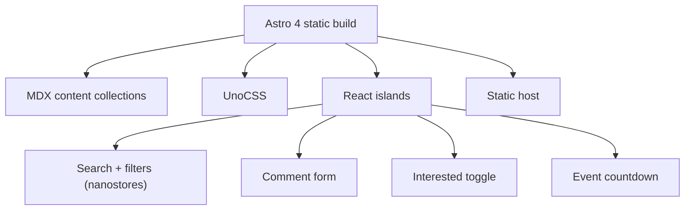

## Overview

InnovaTech is an Astro-based static platform built as a team entry for the InnovaTech 2024 competition. It publishes articles, events, projects, and community pages as MDX content, and layers React islands on top for search, filtering, comments, and a countdown timer. The repository lives under my teammate Vunky Himawan's account.

| Metric | Value |
|---|---|
| Pages | 9 |
| Components | 34 |
| Content docs | 21 (5 articles, 6 events, 5 projects, 5 communities) |
| Framework | Astro 4 static |
| Styling | UnoCSS atomic CSS |
| Interactivity | Client-side React islands |

## Problem

- A competition entry needed to look and feel like a real tech community, without a backend to maintain
- Content had to be easy to add and update during the event
- Interactions like search and filtering had to work on a fully static deployment

## Goal

- Build a fast static site with Astro and MDX content collections
- Add client-side interactivity with React islands and nanostores
- Keep everything deployable to any static host with zero servers

## Role

Team project for the InnovaTech 2024 competition. The code repository is hosted under teammate Vunky Himawan's GitHub account.

**Team:** InnovaTech team, repo by Vunky Himawan

## Architecture

Astro renders every page at build time from MDX content collections. React components mount as islands for interactivity, and UnoCSS generates the atomic styles. There is no server at runtime.

## Content Model

Content lives in 21 MDX documents across four collections: articles, events, projects, and communities. Each page type uses a shared layout that renders the list and detail views with tags for filtering.

## Key Features

- **Search & Filter**: Client-side filtering across content by category and tag using nanostores
- **Article / Event / Project Pages**: Typed layouts with tag-based navigation
- **Comment Form**: Client-side comment entry on content pages
- **Interested Toggle**: Heart-style engagement state per event
- **Countdown Timer**: React countdown for upcoming event dates

## Technical Decisions

- **Astro** for a fast static build with minimal JavaScript on first paint
- **MDX content collections** so the team could author pages without touching components
- **UnoCSS** for on-demand atomic CSS that keeps the bundle small
- **React islands** for the few places that genuinely need interactivity
- **framer-motion** for page and component transitions

## Challenges

- All state is client-side and resets on refresh, so filters and toggles are session-only
- Keeping the static build fast while adding React islands required limiting where islands mount
- Content was authored as placeholder during the competition window

## Outcome

The site delivered a polished static platform for the competition, with content-driven pages and working client-side interactions. It demonstrated a modern frontend toolchain in Astro, MDX, and UnoCSS.

## Final Thoughts

InnovaTech showed how much a static site can do without a backend. Content collections made the team's workflow simple, and React islands added just enough interactivity. The project reinforced that choosing the right tool for a static job beats reaching for a heavier stack.
