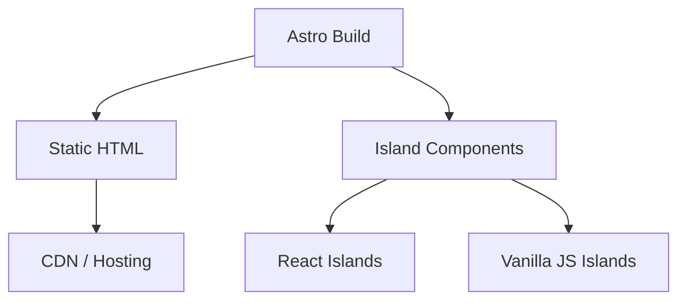

## Overview
InnovaTech was a national competition entry for the Itechno event in 2024. The project explored Astro as a static site generator, focusing on ultra-fast frontend performance and modern tooling. I participated as a team member, contributing to frontend development while learning Astro's island architecture and build-time rendering approach.
## Problem
- The competition required building a web application with modern frontend tooling
- Static site generators offered performance benefits but were unfamiliar territory
- The team needed to deliver a polished application within the competition deadline
## Goal
- Build a performant static site using Astro
- Explore island architecture for partial hydration
- Deliver a competition-ready application on time
## Role
I contributed to frontend development as part of the team.
**Team:** Achmad Raihan Fahrezi Effendy (Team Member) + teammates
## Architecture

## Key Features
- **Static Site Generation** — Pre-rendered HTML for maximum performance
- **Island Architecture** — Interactive components hydrated independently
- **Fast Build Times** — Astro's build process optimized for speed
- **Minimal JavaScript** — Only interactive islands load JavaScript
## Technical Decisions
- Astro was chosen for its performance-first approach and island architecture
- Static generation eliminated server-side rendering complexity
- Island architecture allowed interactive components without loading a full SPA framework
## Challenges
- Astro's content collection system and island architecture required learning new patterns
- Balancing static content with interactive components needed careful planning
- Competition deadlines forced prioritization of features
## Outcome
The team submitted the project for the InnovaTech 2024 competition. The experience provided exposure to modern frontend tooling and performance optimization techniques.
## Final Thoughts
InnovaTech taught me that frontend performance is not just about minification and caching — it is about architecture. Astro's approach to shipping minimal JavaScript by default changed how I think about frontend applications. The experience complemented my backend focus by showing how the frontend can be optimized at the build level.
