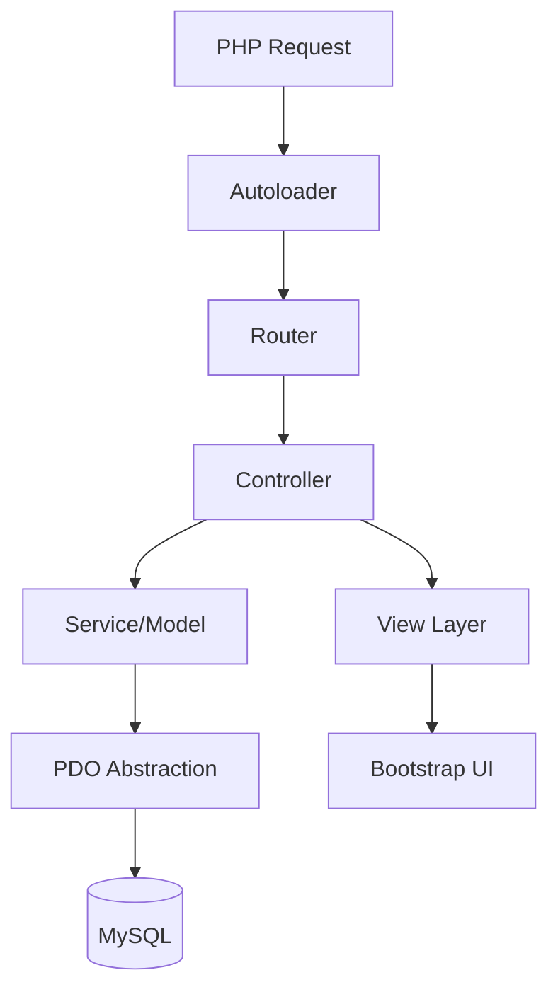

## Overview
Inventory JTI was built under a strict constraint: no framework, no ORM. The coursework for Web Dasar required students to build a complete inventory system using only native PHP. Instead of writing spaghetti code like most teams, I reverse-engineered the concepts behind Laravel — autoloader, service container, routing lifecycle — and built an MVC pattern from scratch. I learned these concepts from Programmer Zaman Now's YouTube channel, which explained PHP internals in a way that made framework patterns feel accessible.
## Problem
- The coursework forbade frameworks and ORMs, forcing students to build everything from scratch
- Most teams produced spaghetti code because they had never built structured PHP applications without Laravel or CodeIgniter
- I wanted to build something that felt like Laravel — structured, modular, maintainable — without using Laravel itself
## Goal
- Build a native PHP MVC architecture by reverse-engineering Laravel concepts
- Implement PHP autoloader for class loading without manual `require` statements
- Understand PHP lifecycle: request → bootstrap → routing → controller → response
- Create a reusable core engine that could power multiple applications
## Role
I led the fullstack architecture and core implementation for a team of 5 developers (3 active coders). I designed the autoloader, MVC pattern, routing system, and database layer that the entire application ran on.
**Team:** Achmad Raihan Fahrezi Effendy (Lead Developer) + 4 teammates
## Architecture

## Key Features
- **PHP Autoloader** — Built a custom autoloader that loads classes automatically, similar to Composer's `autoload.php`. No manual `require` statements needed.
- **PHP Lifecycle Understanding** — Applied knowledge of PHP's request lifecycle: how a request flows from Apache → PHP interpreter → bootstrap → routing → controller → response.
- **Native MVC Framework** — Built routing, controllers, models, and views without any external framework, inspired by Laravel's architecture.
- **Database Abstraction** — PDO layer with Prepared Statements to prevent SQL Injection, without ORM safety nets.
- **Reusable Core Engine** — The architecture powered 2 different applications from the same codebase (other teams managed only 1).
## Technical Decisions
- PHP was the course requirement, but the constraint to avoid frameworks forced deeper understanding
- I studied Laravel's source code and Programmer Zaman Now's YouTube tutorials to understand autoloading, service containers, and routing lifecycle
- MySQL was the database (deployed on XAMPP in campus labs)
- PDO was chosen over mysqli for its database-agnostic abstraction layer
## Challenges
- Building an autoloader from scratch required understanding PHP's `spl_autoload_register` and namespace resolution
- Reverse-engineering Laravel's routing lifecycle without documentation was a steep learning curve
- Coordinating 5 developers on a custom architecture (not a well-documented framework) required clear conventions
## Outcome
The team produced 2 distinct applications from a single core engine — a feat other teams could not achieve with their framework-dependent approaches. The architecture was reusable and maintainable, proving that understanding fundamentals matters more than framework familiarity.
## Final Thoughts
Inventory JTI taught me that frameworks are tools, not crutches. When you understand what a framework does under the hood — autoloading, routing, lifecycle, dependency injection — you can build better systems with or without one. The native PHP MVC I built here became the foundation for understanding every framework I used afterward. The knowledge from Programmer Zaman Now's channel made the difference between writing code and understanding code.
