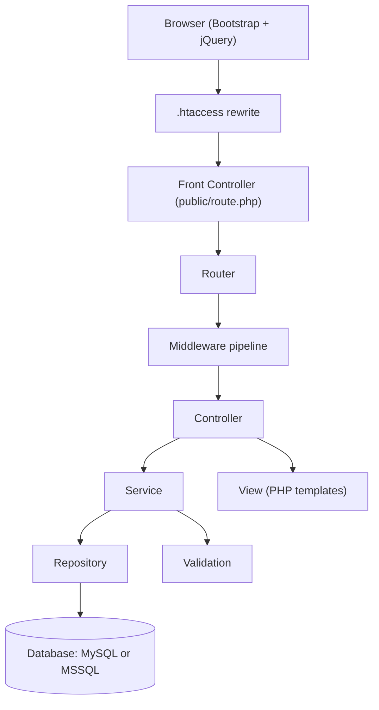
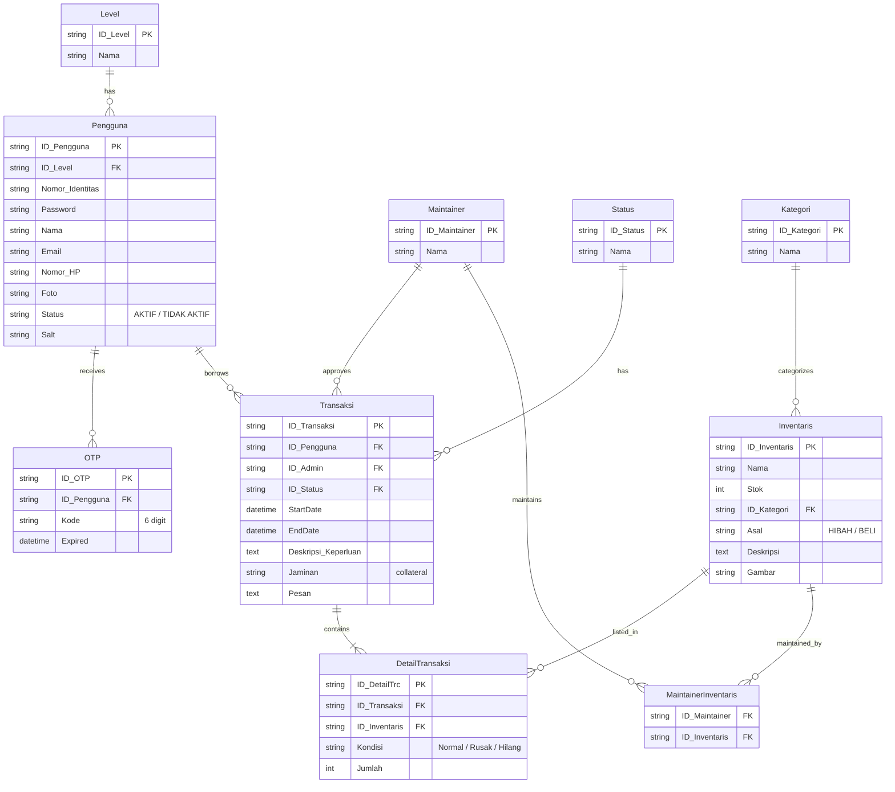
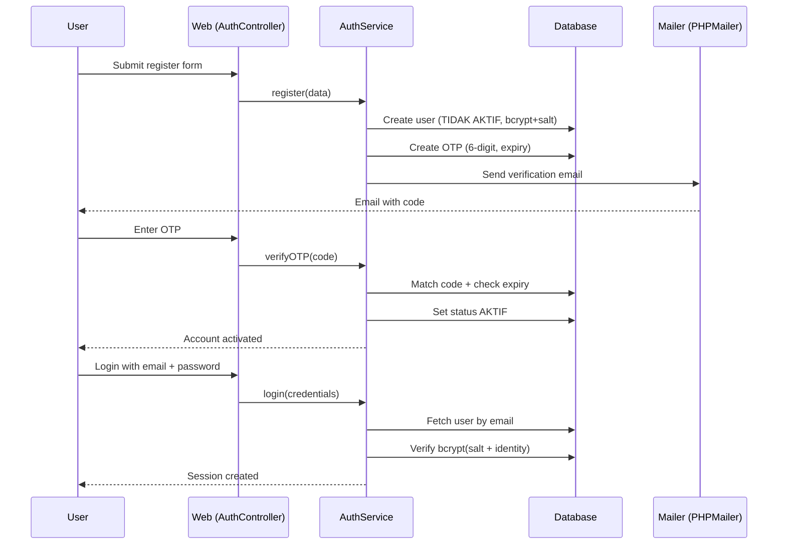
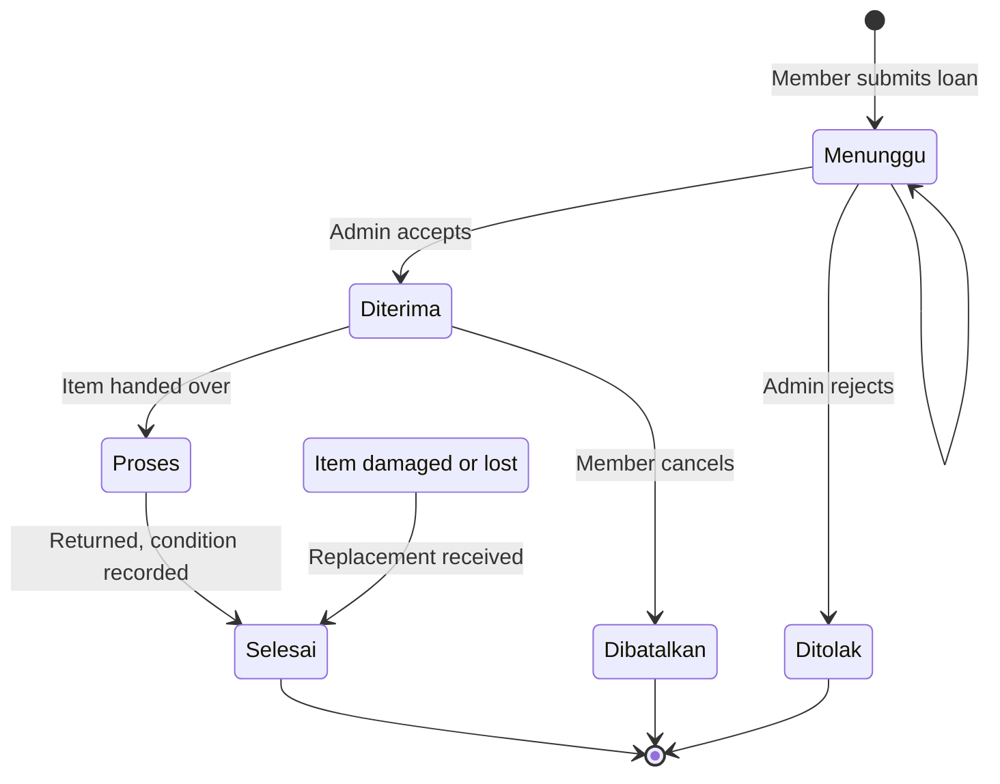

## Overview

Inventory JTI is a full inventory and loan management system for the JTI department. Staff and students borrow equipment, track what they took, and return it with condition reports. I built it for a Web Dasar course that banned frameworks and ORMs, so I wrote the entire engine myself in native PHP. No Composer, no Laravel, no packages beyond a bundled PHPMailer. The result is a working system with 45+ routes, 10 relational tables, email OTP verification, and a 7-state loan workflow.

| Metric | Value |
|---|---|
| Database tables | 10 |
| Loan workflow states | 7 |
| User roles | 3 (Admin, Dosen, Mahasiswa) |
| Routes | 45+ |
| External packages | 0 (PHPMailer bundled) |
| Auth | Register + OTP email, forgot-password reset |

## Problem

- The coursework forbade frameworks and ORMs, so every team built from scratch
- The JTI department tracked borrowed equipment on paper, which lost items and return dates
- Most teams produced flat scripts that grew unmanageable past a few pages
- Five developers needed one structure they could all follow without a framework manual

## Goal

- Build a native PHP MVC engine from Laravel's ideas, without using Laravel
- Ship a complete loan workflow: borrow, approve, return, and condition tracking
- Add secure auth with email verification and password recovery
- Keep the engine database-agnostic so it can run on MySQL or MSSQL

## Role

I led the architecture and core implementation for a team of 4, with 3 of us writing code. I designed the Router, the middleware pipeline, the repository and service layers, and the database driver abstraction the whole system ran on. I built the auth flow end to end.

**Team:** Achmad Raihan Fahrezi Effendy (Lead Developer) + 3 teammates

## Architecture

The engine mirrors Laravel's flow: a front controller receives every request through `.htaccess`, the Router matches it to a controller, middleware runs before the controller, and the controller delegates to Service and Repository layers. The View layer renders PHP templates with Bootstrap.

## Database Design

Ten tables model users, equipment, and loans. `Transaksi` records each loan with a purpose and a collateral entry, and `DetailTransaksi` tracks the condition of each returned item.

## Auth Flow

Registration requires email verification before the account activates. The system generates a 6-digit code, emails it through PHPMailer, and only flips the user to active after the code matches. Passwords are hashed with bcrypt plus a per-user salt, and the salt is bound to the user's identity number during verification.

## Loan Workflow

Every loan moves through a 7-state machine. A member submits a request with a purpose and collateral. An admin accepts or rejects it, the item leaves with a start date, and the return records each item's condition as Normal, Rusak (damaged), or Hilang (lost). A damaged or lost item sends the loan into a replacement state.

## Key Features

- **Custom PHP MVC Engine**: Router, View, and middleware pipeline written from scratch, with zero Composer dependencies
- **Repository + Service + Validation Layers**: 11 models, 11 repositories, 8 services, and 8 validation classes
- **RBAC Middleware**: GuestOnly, AuthOnly, AdminOnly, and MemberOnly guards across 45+ routes
- **OTP Email Auth**: Register and forgot-password flows verified by a 6-digit code sent via PHPMailer
- **Secure Passwords**: bcrypt with a per-user salt bound to the identity number
- **Loan Management**: Borrow with purpose and collateral, approve or reject, track start and end dates
- **Condition Tracking**: Each returned item records Normal, Rusak, or Hilang
- **Multi-Database**: MySQL and MSSQL behind a driver interface, switchable through config
- **Inventory CRUD**: Items with category, stock, origin (HIBAH or BELI), and image upload

## Routes

The route table covers three areas: public auth, member inventory actions, and admin management.

| Area | Routes |
|---|---|
| Auth | register, OTP verification, resend, login, logout, forgot password, OTP reset |
| Member | dashboard, loan form, submit loan, loan history, delete history |
| Admin | dashboard, loan data, update loan, inventory CRUD, maintainer CRUD, loan history |
| Profile | view profile, edit profile, change password, messages, delete account |

## Technical Decisions

- **Native PHP** because the course banned frameworks, and the constraint forced me to learn how a router, a container, and middleware work
- **Zero Composer**: every class loads through explicit `require_once`; the only bundled code is PHPMailer. Nothing to audit, nothing to update
- **bcrypt + per-user salt** instead of plain hashing, with the salt bound to the identity number so two identical passwords hash differently
- **OTP by email** over phone verification, since the department runs on email and PHPMailer was already reliable
- **MySQL + MSSQL drivers** behind one interface, so the app works in the campus labs (MySQL) and in any client environment (MSSQL)
- **Repository pattern** to keep SQL out of controllers and services, modeled on the separation Laravel teams use

## Challenges

- Writing a Router and middleware pipeline from scratch meant matching every request to a pattern, and getting the `.htaccess` rewrite to feed clean paths to the front controller
- Enforcing code quality across a team working without framework conventions demanded written standards and regular review
- Wiring OTP email end to end required handling SMTP failures, expiry windows, and resend paths
- Keeping the loan state machine consistent across member, admin, and history views took the most careful design

## Outcome

The system shipped with 45+ routes, a full OTP auth flow, and a working loan workflow for the JTI department. The engine ran the course project and proved that a framework-grade structure is possible in plain PHP. The lecturer recognized the project for its architecture, and it earned top marks.

## Final Thoughts

Inventory JTI taught me that frameworks are tools, not crutches. Once you understand what Laravel does under the hood, routing, middleware, repositories, you can build the same structure by hand. The zero-dependency constraint made every layer intentional. The native PHP engine I built here became the foundation for how I read and evaluate every framework afterward.
