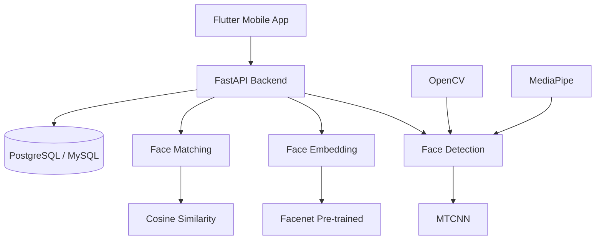

## Overview
Fest Ticketing AI was built as a combined project for 3 university courses (Digital Image Processing, Machine Learning, and Mobile Programming). The system uses face recognition for event ticketing — attendees register their face, and at the venue, a camera captures their image and matches it against the database. I built the AI backend pipeline using FastAPI, MTCNN for face detection, Facenet for embedding generation, and Cosine Similarity for matching.
## Problem
- Traditional ticketing systems can be bypassed with stolen or shared tickets
- The coursework required integrating AI (face recognition) with a mobile application
- Training a face recognition model from scratch was not feasible within the deadline and hardware constraints
## Goal
- Build a backend API that handles face detection, embedding, and matching
- Integrate pre-trained models (MTCNN + Facenet) instead of training from scratch
- Create a working PoC that demonstrates end-to-end face recognition for ticketing
## Role
I built the AI backend pipeline independently, working alongside a mobile team (Flutter) and a frontend team.
**Team:** Achmad Raihan Fahrezi Effendy (AI Backend Engineer) + Mobile Team + Frontend Team
## Architecture

## Key Features
- **Face Detection** — MTCNN detects faces in uploaded images with bounding box coordinates
- **Face Embedding** — Facenet generates 128-dimensional face vectors for comparison
- **Face Matching** — Cosine Similarity compares embeddings to identify registered users
- **Liveness Detection** — Mobile app captures multiple angles (front, left, right, smile) as a simple liveness check
- **Async Processing** — FastAPI handles concurrent face recognition requests efficiently
## Technical Decisions
- FastAPI was chosen for its async support and Python ecosystem for AI/ML libraries
- Pre-trained models (MTCNN + Facenet) were used instead of training from scratch due to time and hardware constraints
- Cosine Similarity was selected for face matching because of its simplicity and effectiveness
- PostgreSQL was used for storing face embeddings with vector operations
## Challenges
- Training a model from scratch failed due to time and hardware limitations — pivoting to pre-trained models was a critical decision
- The face recognition pipeline needed to handle varying lighting conditions and angles
- Integrating the mobile app (Flutter) with the Python backend required careful API design
## Outcome
The system successfully demonstrated end-to-end face recognition for event ticketing. Users could register their face via the mobile app, and the backend could identify them at the venue. The working PoC proved the concept was viable, though it was not production-ready.
## Final Thoughts
Fest Ticketing AI taught me that working PoC is better than perfect theory. The pivot from training custom models to using pre-trained models was not a compromise — it was a practical decision that delivered results within constraints. The experience also showed me how different技术栈 (Python AI backend + Flutter mobile) can integrate through well-designed APIs.
