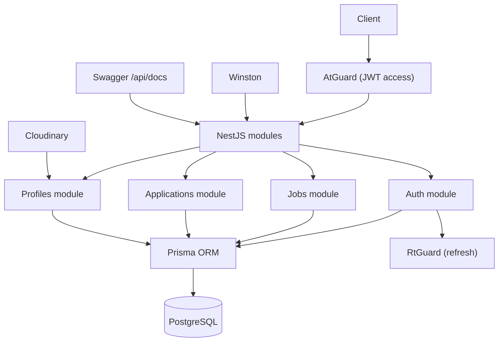
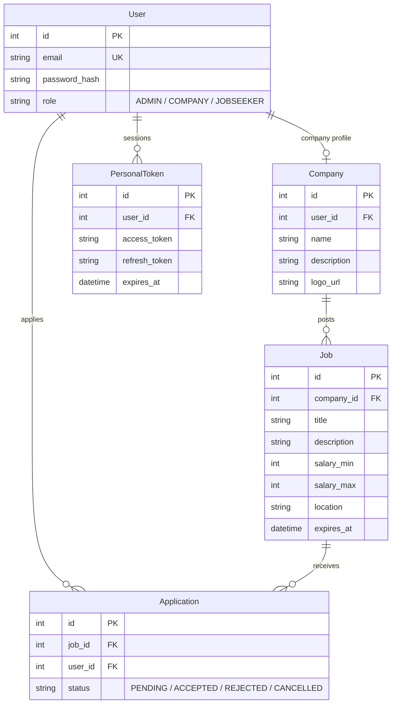
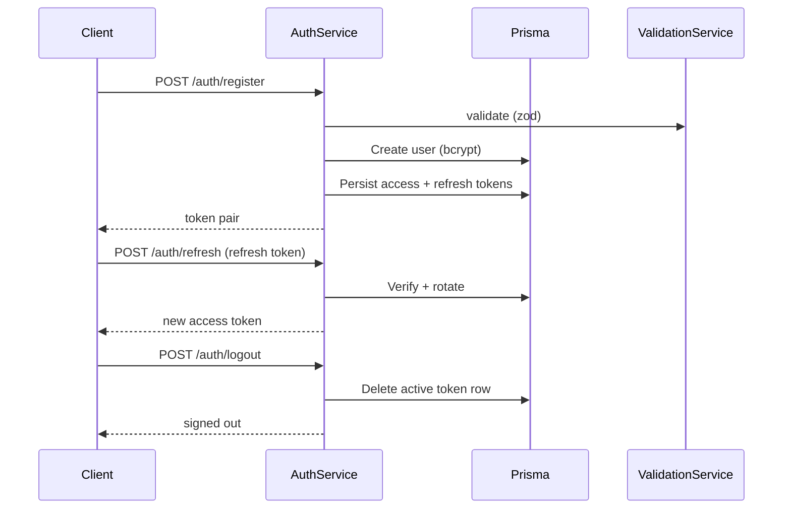

## Overview

Ngejoblist is a job-platform backend built as a technical requirement for an internship application. It exposes 21 endpoints under `api/v1` for authentication, jobs, applications, and profiles, backed by a 5-model Prisma schema. Auth runs on dual JWTs with database-backed refresh tokens, Swagger documents every route, and 86 tests cover the modules. It was the project that made me proficient with NestJS.

| Metric | Value |
|---|---|
| API endpoints | 21 |
| Prisma models | 5 + 2 enums |
| Tests | 86 (27 unit + 59 e2e) |
| Feature modules | 4 |
| Auth | JWT access + refresh, DB-backed |
| Swagger | Live at /api/docs |

## Problem

- The internship application asked for a working backend, not just a resume
- The job domain needs users, companies, jobs, and applications in clear relation
- The code had to demonstrate professional patterns that a technical evaluator would trust

## Goal

- Build a NestJS backend with clean module separation and enterprise patterns
- Implement JWT authentication with role-based access for ADMIN, COMPANY, and JOBSEEKER
- Add Cloudinary uploads and document every endpoint with Swagger
- Cover the flow with unit and e2e tests

## Role

I built the entire backend independently, designing the architecture, implementing the modules, and writing the tests and documentation.

**Team:** Achmad Raihan Fahrezi Effendy (Backend Developer)

## Architecture

Four feature modules sit behind access-token guards, with refresh-token handling in the auth module. Prisma maps every entity to PostgreSQL, and Swagger documents the whole surface.

## Database Design

Five models model the domain. A user is either a jobseeker or a company (one to one), a company posts many jobs, a user submits many applications, and each user holds persisted access and refresh tokens.

## Auth Flow

Auth issues an access token (15 minutes) and a refresh token (7 days), both persisted in `PersonalToken` so a token can be revoked server-side. A refresh issues a new access token and keeps the refresh token. Signing out deletes the active row. Two scheduled jobs run in the background: purging expired tokens daily, and cancelling applications on jobs whose deadline has passed.

## API

Twenty-one endpoints under `api/v1`.

| Area | Endpoints | Purpose |
|---|---|---|
| Auth | 6 | register, login, refresh, logout, change password |
| Jobs | 5 | job CRUD with filters |
| Applications | 5 | apply, list, review, update status |
| Profiles | 4 | user and company profiles with uploads |
| App | 1 | root health |

## Key Features

- **Dual JWT Auth**: 15-minute access and 7-day refresh tokens, both stored in the database
- **DB-Backed Revocation**: Signout and expiry delete the token row server-side
- **Role-Based Access**: ADMIN, COMPANY, and JOBSEEKER separated by guards
- **Job Management**: Post and filter jobs with salary range and date range
- **Application System**: Jobseekers apply, companies review and update status
- **Profile Uploads**: Cloudinary for user and company images
- **Swagger Docs**: Live interactive documentation with bearer auth
- **Scheduled Jobs**: Daily token purge and auto-cancelling applications on expired jobs
- **Test Coverage**: 27 unit and 59 e2e cases across the modules

## Technical Decisions

- **NestJS** because the internship required it, and it made me proficient with the framework
- **Prisma** for schema-first development and type-safe queries
- **Dual JWT with DB persistence** so access stays short and refresh can be revoked
- **Cloudinary** to avoid managing file storage and get CDN delivery
- **Zod** for runtime validation alongside the framework pipes
- **Swagger** wired through the module so evaluators could try every endpoint in the browser

## Challenges

- NestJS's explicit dependency injection took time to internalize after Express middleware
- Designing the company, job, and application relations required careful schema planning
- Keeping environment and config names consistent across `.env`, the config loader, and the README took careful alignment
- Writing complete Swagger documentation meant learning the OpenAPI spec in detail

## Outcome

The project shipped as a working job platform backend with live Swagger docs, role-based auth, and 86 passing tests. It became the foundation of my NestJS proficiency and shaped how I approach API design and documentation.

## Final Thoughts

Ngejoblist taught me that building for a requirement raises the bar. When a technical evaluator will read the code, the decisions need to be deliberate and the documentation thorough. That discipline carried into every project after, and NestJS's structured approach matched how I think about backend architecture.
