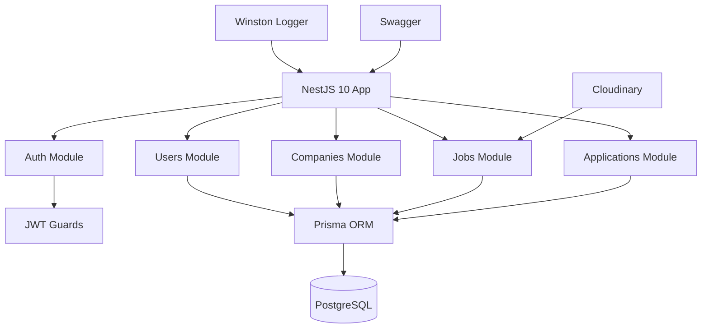

## Overview

Ngejoblist was built as a technical requirement for an internship application. The task was to build a job platform backend using NestJS, demonstrating production-style API structure, authentication, and business logic. This project pushed me beyond coursework into building something that resembled a real product with enterprise-grade patterns and documentation.

## Problem

- The internship application required a technical demonstration — not just a resume, but a working backend system
- I needed to prove I could build production-style APIs with authentication, authorization, and complex business logic
- The job platform domain required handling multiple entities: companies, jobs, applications, and users with proper relationships
- The code needed to demonstrate professional patterns that would impress technical evaluators

## Goal

- Build a job platform backend that demonstrates NestJS best practices and enterprise patterns
- Implement JWT authentication with role-based access control for different user types
- Add Cloudinary integration for image uploads without managing file storage infrastructure
- Document every endpoint with Swagger for professional presentation

## Role

I built the entire backend independently, designing the architecture, implementing all modules, and writing comprehensive documentation.

**Team:** Achmad Raihan Fahrezi Effendy (Backend Developer)

## Architecture

## Key Features

- **JWT Authentication** — Register, login, and token refresh with bcrypt password hashing and secure token storage
- **Role-Based Access** — Separate permissions for job seekers, companies, and administrators with guard-based enforcement
- **Job Management** — Full CRUD operations for job postings with filtering, search, and pagination
- **Application System** — Job seekers can apply to positions, companies can review and manage applications
- **Image Uploads** — Cloudinary integration for company logos and job images with optimization
- **Rate Limiting** — Throttler middleware to prevent API abuse and ensure fair usage
- **Structured Logging** — Winston with daily log rotation for production-ready monitoring
- **Swagger Docs** — Interactive API documentation for every endpoint with request/response examples

## Technical Decisions

- **NestJS** was chosen because the internship required it — this was the project that made me proficient with the framework's architecture
- **Prisma** was used for schema-first development and type-safe database queries, catching errors at compile time
- **Cloudinary** was chosen for image uploads to avoid managing file storage infrastructure and benefit from CDN delivery
- **Winston with daily rotation** was added for production-ready logging that doesn't consume excessive disk space
- **Zod** was integrated for runtime validation alongside NestJS's built-in validation pipes

## Challenges

- Understanding NestJS modules, providers, and dependency injection took significant time — the framework's explicit DI system is more complex than Express middleware
- Designing the application flow between job seekers and companies required careful schema planning to handle many-to-many relationships
- Building something that felt "production-ready" without actual production deployment was a mental shift from academic projects
- Writing comprehensive Swagger documentation for every endpoint required understanding OpenAPI specification format in detail

## Outcome

The project was submitted as part of the internship application and demonstrated production-style backend skills. It became the foundation for my NestJS proficiency and influenced how I approach API design. The comprehensive documentation and clean architecture were noted positively during the evaluation process.

## Final Thoughts

Ngejoblist taught me that building for a requirement is different from building for yourself. When the stakes are higher, the code needs to be cleaner, the decisions need to be more deliberate, and the documentation needs to be more thorough. That discipline carried into every project after. The experience also confirmed that NestJS's structured approach to backend development aligns with how I think about software architecture.
