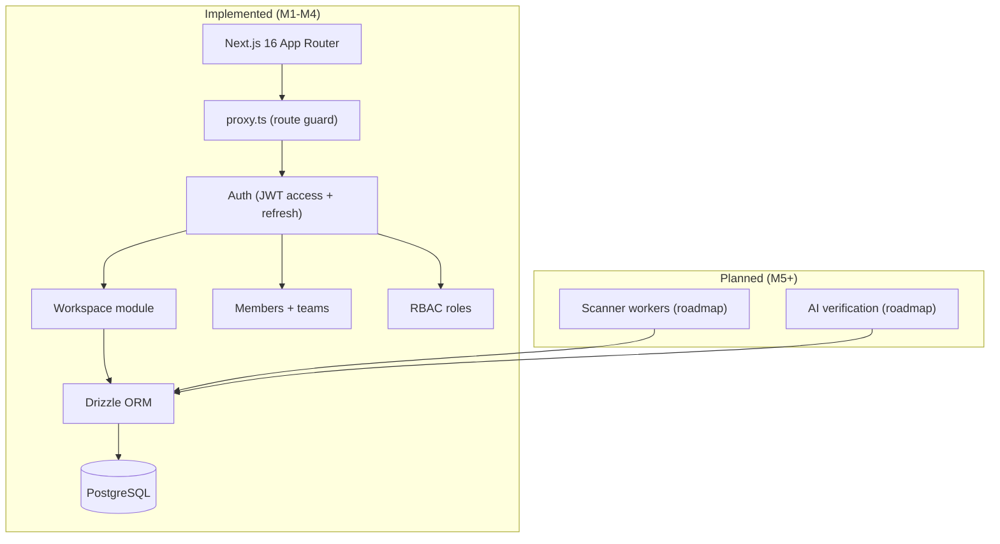
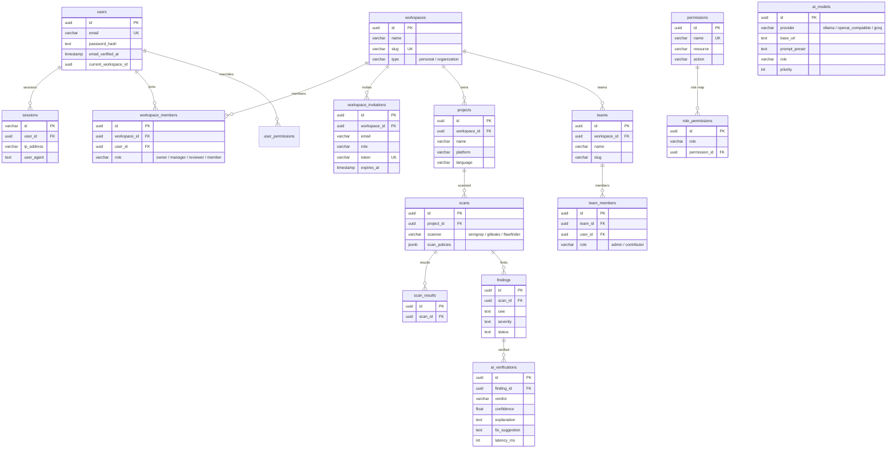
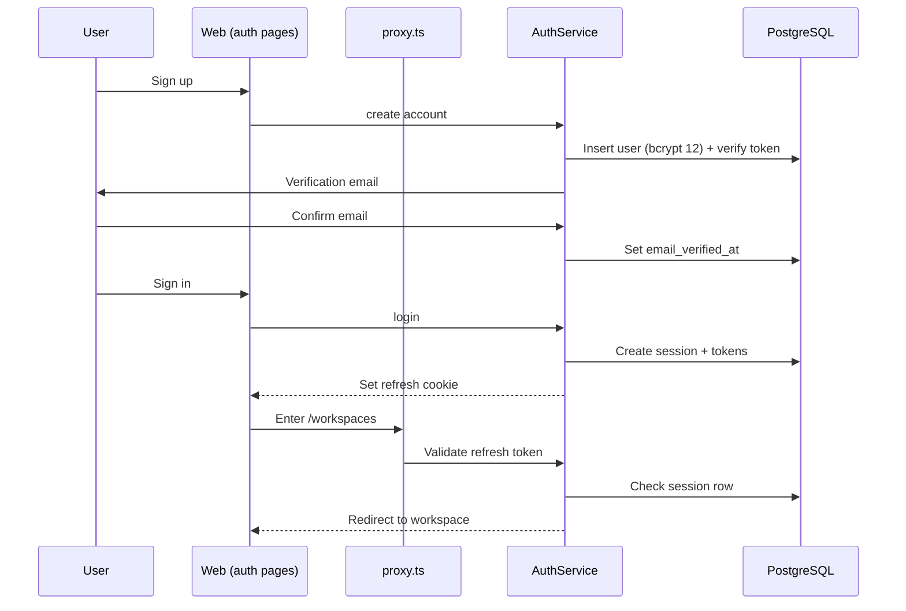

## Overview

SAST Integration is my thesis project, currently at milestone M4 of a larger roadmap. It is a security platform for managing static-analysis workflows across workspaces, built on Next.js 16, Ant Design, and Drizzle. The foundation that is implemented and tested covers authentication, sessions, workspace multi-tenancy, teams, and a role hierarchy. The data model is the furthest along: a 41-table schema that already maps the full SAST and AI-verification domain. The scanning pipeline and the AI verification layer are the next milestones, designed in the schema and documented in the roadmap but not yet built.

| Metric | Value |
|---|---|
| Database tables | 41 |
| API route handlers | 24 |
| Tests | 131 (46 unit + 42 e2e + 43 Playwright) |
| Auth | JWT access + refresh, httpOnly cookie |
| RBAC | 4 role levels, 24 permissions catalog |
| Milestone | M4 (auth + workspace) |

## Problem

- Static-analysis tools drown developers in false positives that must be triaged by hand
- No single platform ties multiple scanners to verified findings in a collaborative workspace
- A thesis needs a research-grade platform whose data model supports the full problem even before every part ships

## Goal

- Build a secure multi-tenant platform with rock-solid authentication as the foundation
- Design a database that models scanners, findings, AI verification, reports, and webhooks end to end
- Implement workspace and team management with a role hierarchy
- Keep the SAST scanning and AI-verification milestones on the roadmap with the data model ready

## Role

I am building the entire platform independently, covering full-stack development, security, and the AI research agenda.

**Team:** Achmad Raihan Fahrezi Effendy (Full-Stack Developer, thesis)

## Architecture

The implemented surface is auth, sessions, workspaces, members, and role levels. The SAST and AI modules exist as schema and roadmap entries, ready to be wired next.

## Database Design

The 41-table schema is the real core of the thesis. Identity and workspace tables use camelCase columns; the planned SAST domain uses snake_case. This is a subset showing both sides: the multi-tenant foundation that works today, and the scanner and AI tables that the next milestone fills.

## Auth & Workspace Flow

Authentication runs on JWT access and refresh tokens, with the refresh token in an httpOnly cookie and session rows checked on every request. Email verification and password reset use single-use tokens with rate limiting.

## API

Twenty-four route handlers across 22 files, all auth and workspace.

| Area | Handlers | Purpose |
|---|---|---|
| Auth | several | signup, signin, signout, email verify, password reset |
| Workspace | several | CRUD, switch, settings |
| Members | several | invite, accept, change role, remove |
| Teams | several | team CRUD and membership |

## Key Features

- **JWT Auth with Refresh**: Access and refresh tokens, httpOnly refresh cookie, session rows for signout invalidation
- **Email Verification & Password Reset**: Single-use tokens with rate limiting
- **Workspace Multi-Tenancy**: Personal and organization workspaces with a chooser UI
- **Member Invites**: Invite by email with role assignment and expiry
- **Role Hierarchy**: owner, manager, reviewer, and member enforced through workspace middleware
- **Permission Catalog**: 24 permissions and role mappings seeded in the database
- **Route Guarding**: Next.js 16 `proxy.ts` protecting authenticated areas and redirecting guests
- **Env Hardening**: Zod-validated environment that rejects default secrets in production
- **Test Coverage**: 131 tests across unit, e2e, and Playwright, all green

## Roadmap

The schema and roadmap already define what comes next, even though the code does not implement it yet:

- **SAST Scanning**: `scans`, `scan_results`, and `findings` tables model Semgrep, Gitleaks, and Flawfinder runs with policies
- **AI Verification**: `ai_verifications` and `ai_models` model a model-agnostic verification layer with verdicts, confidence, and fix suggestions
- **Reports, webhooks, quality gates, and scheduled scans**: all present as tables in the 41-table schema

## Technical Decisions

- **Next.js 16 App Router** with `proxy.ts` for route protection and server components
- **Drizzle ORM** for a SQL-first schema that stays close to the database
- **jose JWT** with HS256, short access tokens, and server-side session validation
- **bcryptjs at 12 rounds** for password hashing
- **Ant Design** for the enterprise UI surface
- **Zod** across the stack, including strict environment validation in production

## Challenges

- Designing a 41-table schema that supports the full thesis problem before the code for each part exists
- Keeping auth airtight as the foundation, since every later feature depends on it
- Maintaining a consistent naming style across the schema as the two domains grew
- Scoping the thesis so the implemented milestones stay shippable while the research agenda continues

## Outcome

The project is on track for a June 2026 thesis defense with a working M4 foundation: secure auth, multi-tenant workspaces, role management, and a 41-table data model for the full SAST and AI domain. The remaining milestones build the scanning pipeline and AI verification on top of the schema already in place.

## Final Thoughts

SAST Integration is the most ambitious project I have built, and it taught me to stage complexity. The schema forces the design thinking before the code, and the implemented foundation keeps the platform real while the research continues. Building it has sharpened my skills across security, full-stack development, and the discipline of a thesis timeline.
