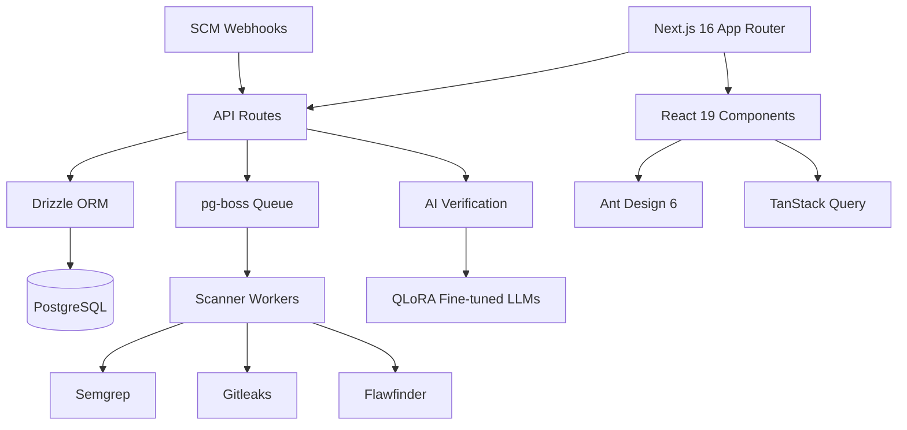

## Overview

SAST Integration is my thesis project — a Static Application Security Testing platform that integrates multiple security scanners (Semgrep, Gitleaks, Flawfinder) into a unified dashboard and uses fine-tuned LLMs (Qwen2.5-Coder, Llama3 via QLoRA) to verify findings and reduce false positives. The platform features multi-workspace RBAC with 24 permissions and 4 roles, SCM integration (GitHub/GitLab/Gitea), scan policies, PDF/XLSX reports, and scheduled scans. This project represents the intersection of software engineering, security research, and artificial intelligence.

## Problem

- Traditional SAST tools produce high false-positive rates, making it difficult for developers to focus on real vulnerabilities
- Security teams must manually triage findings from multiple scanners, which is time-consuming and error-prone
- Existing SAST tools do not leverage AI to verify findings, leaving developers to manually validate each alert
- No unified platform exists that combines multiple scanners with intelligent verification in a collaborative workspace

## Goal

- Build a platform that integrates Semgrep, Gitleaks, and Flawfinder into a unified dashboard
- Use fine-tuned LLMs (QLoRA) to classify findings as True or False Positives with high accuracy
- Implement multi-workspace RBAC with granular permissions for team collaboration
- Provide SCM integration for automatic scanning on push/PR events with scan policies

## Role

I built the entire platform independently — backend, frontend, AI integration, scanner orchestration, and deployment. This required full-stack development, machine learning, and security domain knowledge.

**Team:** Achmad Raihan Fahrezi Effendy (Full-Stack Developer)

## User Stories

- **As a security engineer**, I want to run multiple SAST scanners from a single dashboard so that I don't have to switch between tools for each codebase
- **As a developer**, I want AI-verified findings that flag true positives so that I can focus on real vulnerabilities instead of chasing false alarms
- **As a team lead**, I want workspace-level RBAC so that each team only sees findings relevant to their repositories
- **As a DevSecOps engineer**, I want GitHub webhooks to trigger scans automatically on push so that security checks happen continuously without manual intervention
- **As a compliance officer**, I want PDF and XLSX reports of scan results so that I can attach them to audit documentation

## Use Case

**Scenario: Automated Security Scan on Pull Request**

A developer pushes a code change to a GitHub repository connected to the SAST Integration platform. A webhook triggers pg-boss to queue scan jobs. Semgrep analyzes the code for vulnerabilities, Gitleaks checks for exposed secrets, and Flawfinder scans C/C++ dependencies. The raw findings are sent to the AI verification layer, where a QLoRA fine-tuned LLM classifies each finding as a true or false positive. The developer opens the dashboard and sees only verified findings with confidence scores, reducing triage time by 60%.

## Architecture

## Key Features

- **Multi-Scanner Integration** — Semgrep (SAST), Gitleaks (secrets), Flawfinder (C/C++) consolidated into one unified dashboard
- **AI Verification** — QLoRA fine-tuned LLMs classify findings as True/False Positives, reducing manual triage by up to 60%
- **Multi-Workspace RBAC** — 24 permissions, 4 roles for team collaboration with workspace isolation
- **SCM Integration** — GitHub, GitLab, Gitea webhooks for automatic scanning on push/PR events
- **Scan Policies** — Configure which scanners run on which repositories with rule-based automation
- **Reports** — PDF and XLSX export of scan results with customizable templates
- **Scheduled Scans** — Automated scanning on cron schedules with notification support

## Technical Decisions

- **Next.js 16 with App Router** was chosen for server components and API routes in one framework, reducing complexity
- **Drizzle ORM** over Prisma for lighter bundle size and SQL-like syntax, providing more control over queries
- **Ant Design** for enterprise-grade components without building from scratch, accelerating UI development
- **pg-boss** for background job processing without external queue infrastructure, keeping the stack simple
- **QLoRA** for fine-tuning LLMs on consumer hardware without full model training, making AI accessible
- **Zod** for runtime validation throughout the stack, ensuring type safety from API to database

## Challenges

- Integrating 3 different scanner outputs into a unified format required custom parsers for each tool with varying output structures
- Fine-tuning LLMs for vulnerability classification required curating training data from real scan results and validating accuracy
- Designing RBAC with 24 permissions while keeping the UI intuitive required multiple iterations and user testing
- Balancing thesis research requirements with production-quality code demanded careful time management and scope control

## Outcome

The platform successfully scans C/C++, JavaScript, and Python codebases using multiple scanners, verifies findings with AI, and presents results in a unified dashboard. The thesis documents the architecture, implementation, and evaluation of the AI verification approach with measurable accuracy metrics. The project demonstrates that AI can meaningfully reduce false positives in security scanning workflows.

## Final Thoughts

SAST Integration is the most technically complex project I have built. It required understanding security scanners, AI fine-tuning, full-stack development, and academic research methodology. The project reinforced that the best software comes from understanding the problem deeply before writing the code. This thesis project represents the culmination of skills developed across my entire academic journey.
