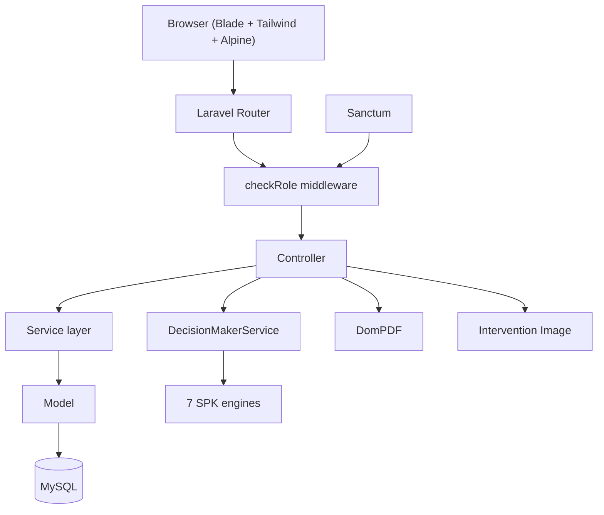
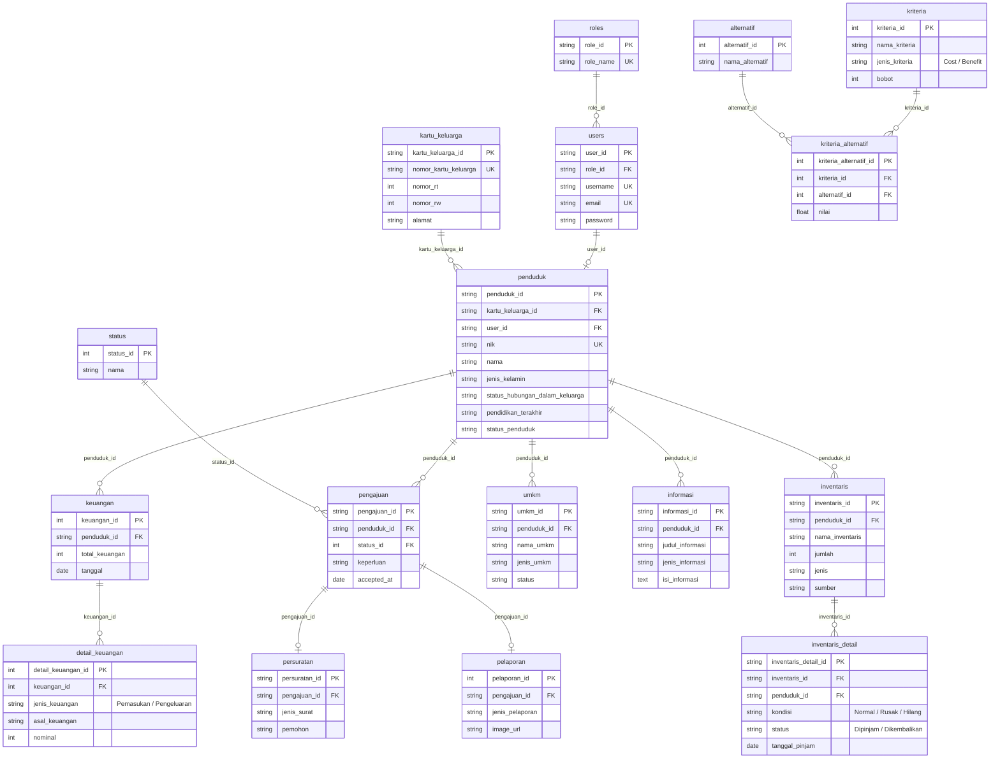
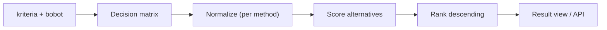
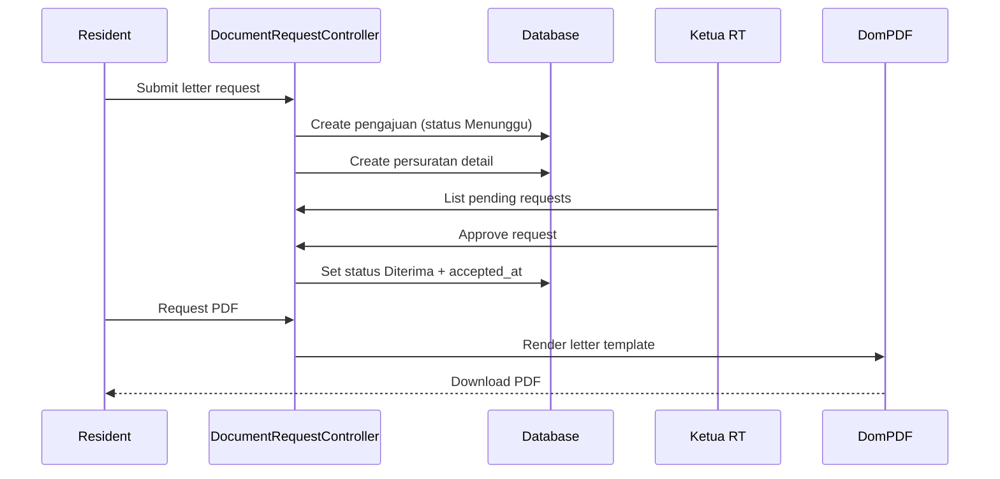

## Overview

SatuRT is a neighborhood association (RT) management system built for a Framework Programming course on Laravel. It handles resident data, family cards, finances, complaints, document requests, UMKM listings, announcements, and inventory borrowing for a single RT. On top of the daily operations, it runs a generic Decision Support engine with 7 SPK methods that rank activities, aid recipients, or any alternative against weighted criteria. The system deployed live at saturt.cloud for real-world testing.

| Metric | Value |
|---|---|
| Database tables | 20 |
| Routes | 150 (130 web + 20 read-only API) |
| SPK decision methods | 7 |
| User roles | 2 (Ketua RT, Penduduk) |
| Models / Controllers | 17 / 29 |
| Services | 26 |
| Approx. code size | 33,000 LOC |

## Problem

- RT associations keep resident data, dues, and events on paper or scattered spreadsheets, which leads to loss and inefficiency
- The course required a Decision Support System that ranks alternatives against weighted criteria
- The team needed clear delegation: CRUD work to members, architecture and decision logic to the lead
- Existing neighborhood tools lacked the analytics needed for data-driven decisions

## Goal

- Build a Laravel app with role-based access control using Laravel Sanctum and role middleware
- Ship a generic Decision Support engine that works for any criteria set, not one hard-coded case
- Generate official letters as PDF and keep a running balance of RT finances
- Deploy to a live server for real-world use and demonstration

## Role

I led the architecture and core implementation, delegated the CRUD work to teammates, and focused on RBAC, the decision-support engine, and the production deployment.

**Team:** Achmad Raihan Fahrezi Effendy (Lead Developer) + 3 teammates

## Architecture

The app follows standard Laravel layering with a service layer on top. `DecisionMakerService` is the base for 7 SPK engines that all read the same `kriteria`, `alternatif`, and `kriteria_alternatif` tables. Sanctum guards both web and API routes, and a `checkRole` middleware enforces the RT and resident roles.

## Database Design

Twenty tables model the RT domain. Residents belong to family cards, every document request and complaint is a `pengajuan` with a status, finances keep a running balance, and the SPK module stores criteria, alternatives, and their normalized scores separately from the operational data.

## Decision Support Engine

The engine is data-driven. Criteria carry a type (Cost or Benefit) and a weight; alternatives carry a score per criterion. Any method can rank the same matrix, which means the engine stays reusable across problems. The seeded use case ranks 10 neighborhood activities by 5 criteria, with Relevance and Social Impact as benefit criteria and Cost and Difficulty as cost criteria.

The 7 methods implemented:

| Method | Approach |
|---|---|
| SAW | Weighted sum of normalized Benefit (`x/max`) and Cost (`min/x`) scores |
| SMART | Unity-min-max normalization with internally normalized weights |
| EDAS | Distance from average, positive and negative, combined into an appraisal score |
| MABAC | Distance from the border approximation area |
| MOORA | Vector-normalized benefit minus cost ratio |
| ARAS | Utility of each alternative against an ideal solution |
| ELECTRE | Concordance and discordance matrices with dominance thresholds |

The ranking pipeline is shared: build the decision matrix, normalize weights, run the method's scoring, and sort descending.

## Document Request Flow

A resident requests a letter (KTP, KK, birth certificate, SKCK, marriage, or other). The request lands in `pengajuan` with status Menunggu, an admin (Ketua RT) approves or rejects it, and an approved request generates the official letter as a PDF through DomPDF.

## Key Features

- **7 SPK Methods**: SAW, SMART, EDAS, MABAC, MOORA, ARAS, and ELECTRE in one data-driven engine
- **Resident & Family Cards**: NIK-keyed residents grouped by family card, with business rules on family heads
- **RBAC**: Sanctum auth with a `checkRole` middleware and 2 roles, including RT role transfer
- **Running-Balance Finances**: Income and expense ledger that keeps the balance in sync on every write
- **Document Requests + PDF**: Official letters generated with DomPDF after approval
- **Complaints (LAPOR!)**: Residents file reports with optional images and track status
- **Inventory & Borrowing**: Items with condition tracking (Normal, Rusak, Hilang) and borrow dates
- **UMKM Directory**: Local business listings with public pages and a paginated API
- **News & Announcements**: 5 content types with CKEditor and HTML sanitization
- **Read-Only API**: 20 Sanctum-protected endpoints exposing the same data to mobile or external clients

## Routes

150 routes split between web and a read-only API. The web side covers public landing pages, resident self-service, and RT administration.

| Area | Routes |
|---|---|
| Public | home, news, UMKM listings, login, password reset |
| Resident | document requests, complaints, profile, UMKM, family members, news |
| Ketua RT | family cards, finances, alternatives, criteria, SPK results, inventory, accounts, document approval |
| API | 20 read-only v1 endpoints for news, UMKM, reports, finance, SPK rankings |

## Technical Decisions

- **Laravel 10** for its mature ecosystem, Sanctum auth, and Blade templating
- **Generic SPK engine** over hard-coded cases, so the same 7 methods rank activities, aid, or anything else defined in `kriteria`
- **Sanctum + checkRole middleware** for token auth and role checks on both web and API routes
- **DomPDF** for official letters that residents can download and print
- **Intervention Image** to resize resident photos and KTP uploads on the fly
- **Purify** to strip unsafe HTML from CKEditor content before it hits the database
- **UUID primary keys** for resident-facing records, keeping IDs unguessable in public URLs

## Challenges

- Keeping 7 SPK methods consistent over one decision matrix took careful weight normalization and result checking
- Delegating CRUD while keeping code quality meant consistent reviews and written standards
- First production deployment taught me server configuration, SSL certificates, and domain setup
- The RT role-transfer flow had to demote the previous leader and force a re-login without breaking their session mid-action

## Outcome

The system deployed and demonstrated at the course presentation, and the live site at saturt.cloud handled real usage. The decision-support engine ran 7 methods side by side, far beyond the single-method implementations other teams showed. Judges noted the breadth of the feature set and the analytical module.

## Final Thoughts

SatuRT taught me that a generic engine beats a hard-coded feature. By keeping the SPK layer data-driven, I added methods without restructuring the app, and the same engine can rank activities today and aid recipients tomorrow. The lead role also showed me that delegation is about keeping quality high while others own their pieces. And the production deployment closed the gap between code that works on a laptop and code that holds up in the real world.
