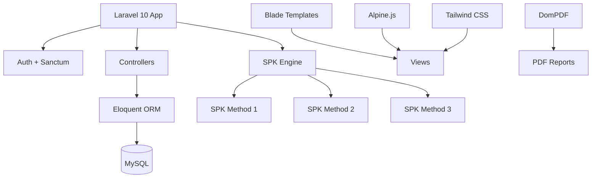

## Overview
SatuRT was built for a university course on Framework Programming (Laravel). The system manages neighborhood association (RT) data — residents, finances, events, complaints, document requests, and UMKM (local business) directory — and integrates 3 parallel Decision Support Systems (SPK) for analytical decision-making. While other teams implemented 1-2 SPK methods, I designed the architecture to support all 3, making the system significantly more functionally rich.
## Problem
- Neighborhood associations (RT) manage resident data, dues, and events on paper or scattered spreadsheets
- The coursework required integrating multiple Decision Support Systems for analytical decision-making
- The team of 4 needed clear delegation — CRUD tasks to members, architecture and SPK logic to the lead
## Goal
- Build a Laravel application with role-based access control (RBAC) using Laravel Sanctum
- Integrate 3 SPK methods in parallel for resident and aid analysis
- Implement PDF generation for reports and HTML purification for user content
- Deploy to a live server for real-world testing
## Role
I led the architecture and core implementation, delegating CRUD operations to team members and focusing on RBAC and SPK logic.
**Team:** Achmad Raihan Fahrezi Effendy (Lead Developer) + 3 teammates
## Architecture

## Key Features
- **Role-Based Access Control** — Laravel Sanctum auth with separate permissions for RT heads, residents, and administrators
- **3 Parallel SPK Methods** — Implemented 3 decision support systems for resident analysis and aid allocation (other teams only managed 1-2)
- **Resident Management** — CRUD operations for resident profiles with family structure tracking
- **Financial Tracking** — Record dues payments, expenses, and generate PDF reports
- **Complaint System** — Residents can submit complaints with status tracking
- **Document Requests** — Request and track official documents
- **UMKM Directory** — Local business directory for the neighborhood
- **Event Management** — Create and manage neighborhood events
- **Live Deployment** — Deployed to production at saturt.cloud
## Technical Decisions
- Laravel was chosen for its mature ecosystem, built-in auth, and RBAC support
- Sanctum was used for token-based authentication
- Alpine.js provided lightweight interactivity without full SPA overhead
- DomPDF was added for generating printable reports
- Intervention Image handled image processing for resident photos
## Challenges
- Delegating CRUD tasks while maintaining code quality required consistent code review
- Integrating 3 SPK methods without them interfering with each other demanded careful module separation
- Deploying to production for the first time taught me about server configuration, SSL, and domain setup
## Outcome
The system was deployed and demonstrated at the course presentation. The 3-SPK architecture was noted as significantly more functionally rich than other teams' implementations. The live deployment at saturt.cloud proved the system could handle real-world usage.
## Final Thoughts
SatuRT taught me that architecture decisions matter more than feature count. By designing the SPK engine as a separate module, I made it possible to add analytical methods without restructuring the entire application. The lead developer role also taught me that delegation is not just about assigning tasks — it is about maintaining quality while empowering others.
