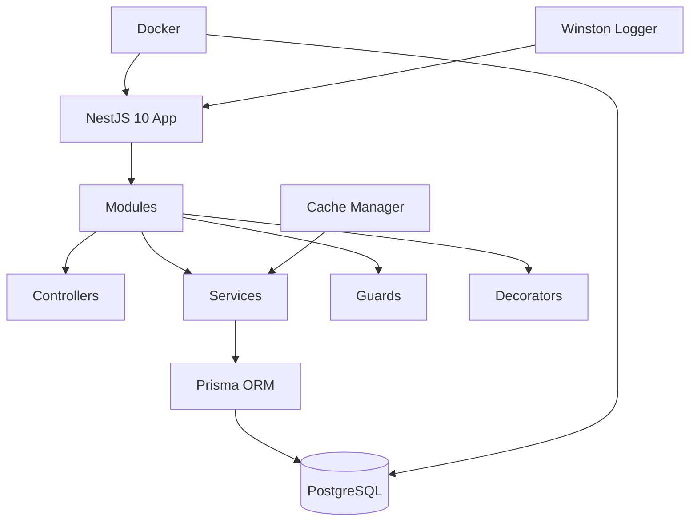

## Overview

Vacation REST API was built for the Iconic IT 2024 national competition in the Web Development category. The task was to build an enterprise-style REST API using NestJS with proper modular architecture, TypeScript, and deployment readiness. I built this project solo and ranked 6th nationally — nearly making the top 5 if not for deployment issues on the final day. The competition validated my NestJS skills and taught me critical lessons about production deployment.

## Problem

- The competition required an enterprise-grade REST API built with NestJS under deadline pressure
- I had limited experience with NestJS at the time — this was my first deep dive into the framework
- Deployment issues on H-1 nearly derailed the submission, highlighting gaps in my deployment knowledge
- The competition demanded professional code quality with proper patterns, not just working functionality

## Goal

- Build a modular, production-style REST API with NestJS demonstrating enterprise architecture patterns
- Demonstrate enterprise patterns: guards, decorators, DTOs, and module separation
- Add structured logging with Winston and caching with cache-manager for production readiness
- Deploy to a live server for competition evaluation within the deadline

## Role

I built the entire backend independently under competition conditions, managing architecture, implementation, and deployment.

**Team:** Achmad Raihan Fahrezi Effendy (Solo Developer)

## Architecture

## Key Features

- **Modular Architecture** — Clean separation of modules, controllers, services, and guards following NestJS conventions
- **Enterprise Patterns** — Custom decorators, DTOs with validation, and guard-based authentication
- **Schema-Driven Data Access** — Prisma for type-safe database operations with migrations and seeding
- **Structured Logging** — Winston integration for request tracking and debugging with custom log formats
- **Response Caching** — Cache-manager for frequently accessed data with configurable TTL
- **Docker Integration** — Containerized development and deployment environment for consistency

## Technical Decisions

- **NestJS** was chosen because the competition valued enterprise architecture patterns and modular design
- **Prisma** was used for schema-first development and type safety, catching errors at compile time
- **Winston** was added for production-ready structured logging that competitors often overlooked
- **Cache-manager** was included to demonstrate performance optimization awareness and reduce database load
- **Docker** was added to demonstrate production-ready deployment practices and environment consistency

## Challenges

- Learning NestJS decorators, dependency injection, and module system under competition pressure required rapid skill acquisition
- Deployment server issues on H-1 nearly prevented submission — this taught me the importance of deployment testing early and having rollback strategies
- Balancing competition features with code quality required strict prioritization and scope management
- Working solo under time pressure demanded efficient decision-making without the benefit of team collaboration

## Outcome

Ranked 6th nationally in the Web Development category at Iconic IT 2024. The judges noted the modular architecture and enterprise patterns, though deployment issues prevented a higher ranking. The experience validated my NestJS proficiency and identified deployment as a critical skill gap.

## Final Thoughts

Vacation REST API was the project that proved I could compete at a national level. The deployment failure on the final day was painful, but it taught me that deployment is not an afterthought — it is part of the product. The NestJS proficiency I gained here became the foundation for my internship work at DOT Indonesia. The competition experience reinforced that building working code is only half the challenge; getting it into production reliably is equally important.
