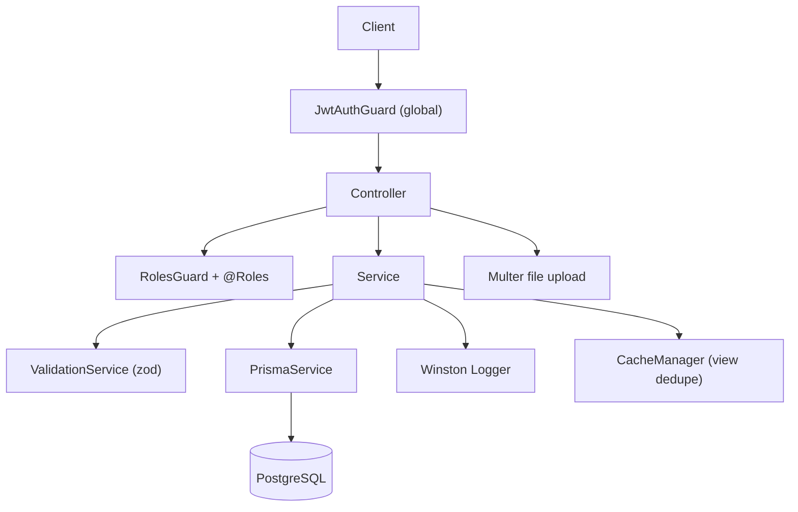
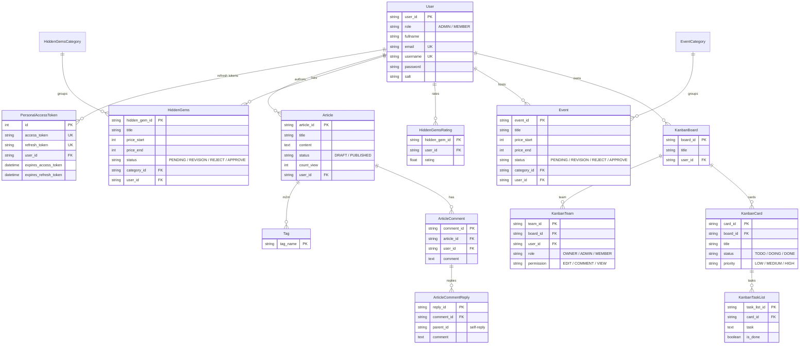
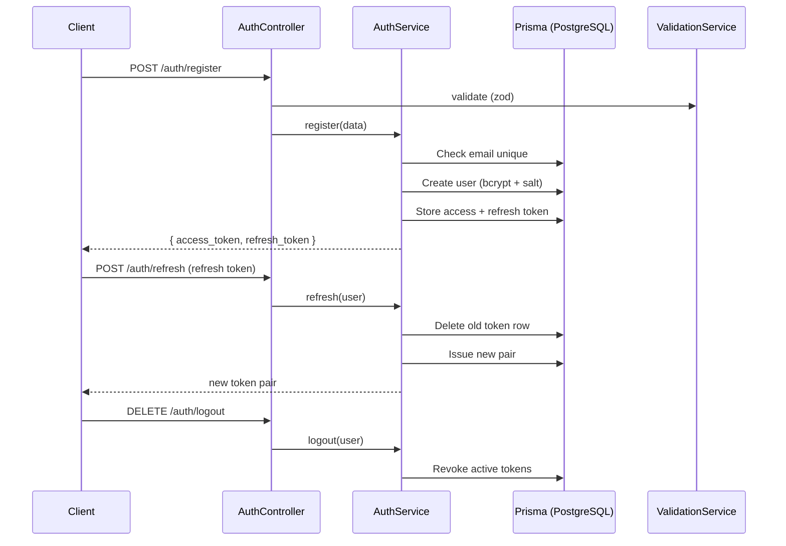
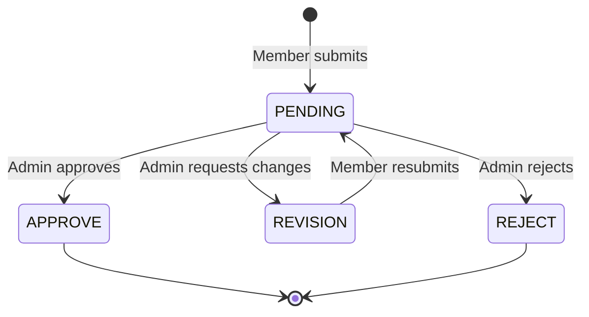

## Overview

Vacation REST API is an enterprise-grade NestJS backend I built solo for the Iconic IT 2024 national competition in the Web Development category. It exposes 66 endpoints across 7 feature modules, backed by a 27-model Prisma schema, JWT auth with refresh rotation, RBAC, and zod validation. I ranked 6th nationally. A deployment issue on the final day cost a higher finish, and that failure taught me more about shipping than the parts that worked.

| Metric | Value |
|---|---|
| Endpoints | 66 |
| Prisma models | 27 + 9 enums |
| Feature modules | 7 |
| Role-restricted routes | 29 |
| Auth | JWT access + refresh rotation, DB-backed revocation |
| Tests | ~20 cases (unit + e2e) |

## Problem

- The competition demanded an enterprise-grade NestJS API under a hard deadline
- I had little NestJS experience at that point, so the framework itself was the steep part
- A deployment problem on H-1 put the submission at risk and exposed gaps in my release process
- Judges scored architecture and code quality, not just working endpoints

## Goal

- Build a modular NestJS API with clean module separation and enterprise patterns
- Ship a real auth system: register, login, refresh rotation, and logout with revocation
- Model four feature domains end to end: articles, hidden gems, events, and kanban boards
- Containerize the app and add seeders so the whole data model is reproducible

## Role

I built the entire backend alone under competition conditions. Architecture, implementation, auth, seeding, and deployment were all mine.

**Team:** Achmad Raihan Fahrezi Effendy (Solo Developer)

## Architecture

Seven feature modules sit behind a global JWT guard: auth, article, user, hidden-gems, event, board, and file-storage. Two global modules provide Prisma and the Winston logger. Guards and decorators keep auth logic out of the services.

## Database Design

The Prisma schema models four domains. Users own articles, hidden gems, events, and kanban boards. Articles carry tags, likes, bookmarks, and nested comments. Hidden gems carry categories, ratings, and operating hours. Boards carry teams, cards, and task lists. This is the core of the 27-model schema.

## Auth Flow

Auth uses an access token and a rotating refresh token, both stored in the database so any session can be revoked. Register hashes the password with bcrypt and a per-user salt, then issues a token pair. Every refresh deletes the old pair and issues a new one.

## Content Workflow

Hidden gems and events run through a moderation state machine. A member submits a listing as PENDING. An admin approves it, sends it back for REVISION, or rejects it. A revision resets the listing to PENDING again.

## Key Features

- **JWT Auth with Rotation**: Access token (3h) plus a refresh token (3d), rotated on every refresh and revoked on logout
- **DB-Backed Sessions**: Every token row lives in `refresh_tokens`, so a leaked token is revoked instantly
- **RBAC**: `RolesGuard` with 29 role-restricted handlers across ADMIN and MEMBER
- **Three-Layer Board ACL**: Access, edit-permission, and ownership guards for kanban teams
- **zod Validation**: Services validate through a shared `ValidationService`, with a global filter mapping `ZodError` to HTTP 400
- **Four Feature Domains**: Articles, hidden gems, events, and kanban boards, each with nested comments, likes, and status flows
- **Winston Logging**: Console and file transports wired through the Prisma client and a user-agent middleware
- **Prisma Seeders**: 24 seeder files generate 8 users, 15 articles, 10 hidden gems, 10 events, and 10 boards
- **Multer File Storage**: Uploads land on disk with per-user folders and a public serve route
- **Docker**: Multi-stage Dockerfile for dev and production builds

## Routes

66 endpoints across 7 prefixes. Fourteen are public; the rest sit behind the global JWT guard.

| Module | Endpoints | Notable routes |
|---|---|---|
| auth | 4 | register, login, refresh, logout |
| user | 3 | profile, update, search |
| article | 14 | CRUD, tags, like, bookmark, nested comments |
| hidden-gems | 13 | CRUD, categories, ratings, admin approve/reject/revision |
| event | 11 | CRUD, categories, interest, admin moderation |
| file-storage | 3 | upload, delete, public serve |
| board | 18 | kanban CRUD, team invite, share links, ownership transfer |

## Technical Decisions

- **NestJS** because the competition valued modular architecture and dependency injection
- **Prisma + PostgreSQL** for schema-first development and compile-time type safety across 27 models
- **JWT refresh rotation** over long-lived tokens, so revoking a device does not require invalidating the whole account
- **bcrypt with per-user salt** stored in its own column, matching the pattern I used across my PHP projects
- **zod over class-validator** for schemas that read like data, with the validation layer kept separate from the DTO classes
- **Winston** for structured logs with file persistence, a layer most competitors skipped
- **Cache-manager** scoped to one job, deduplicating article view counts per IP instead of caching whole responses

## Challenges

- Learning NestJS decorators, dependency injection, and the module system under competition pressure
- The H-1 deployment failure threatened to block the submission and taught me to test releases early with a rollback plan
- Modeling nested comments and self-referential replies in Prisma took careful relation design
- Keeping four feature domains consistent under a solo deadline forced strict scope control

## Outcome

The API ranked 6th nationally in the Web Development category at Iconic IT 2024. Judges noted the modular architecture and enterprise patterns; the deployment issue on the final day cost a higher finish. The experience confirmed my NestJS skills and flagged deployment as the gap to close next.

## Final Thoughts

Vacation REST API proved I could compete at a national level. The deployment failure hurt at the time, but it made deployment a first-class part of my workflow instead of an afterthought. The NestJS skills carried into my internship at DOT Indonesia, and the lesson stuck: shipping working code is half the job, getting it into production is the other half.
